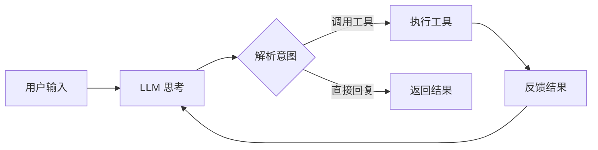
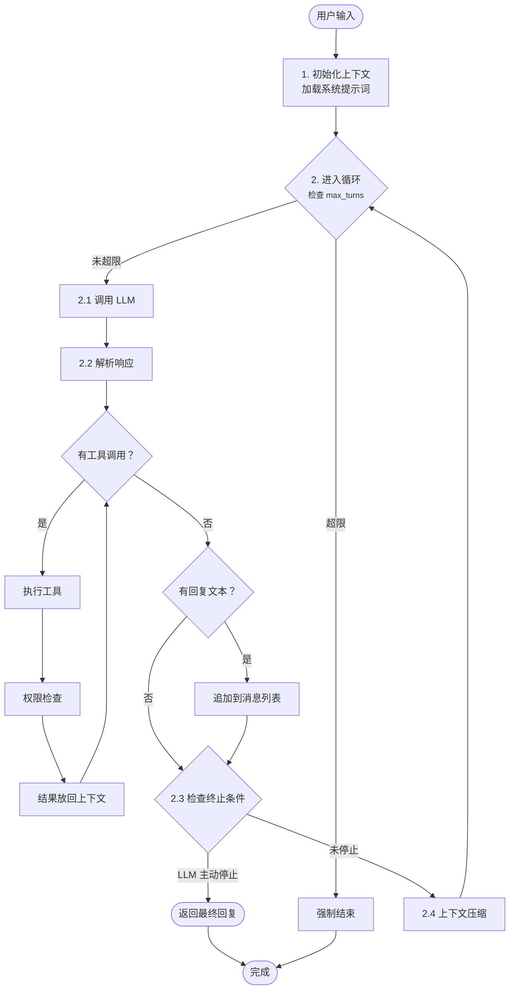

# 01. Agent 大脑：主循环是怎么转起来的

> 从零到一实现一个 AI Agent 框架 · 第一篇

---

## 1. 为什么需要 Agent Loop？

先看一个直接的对比。

**普通 LLM 调用：**

```
用户：帮我查一下 AAPL 的股价，然后写个分析报告
      ↓
LLM：抱歉，我无法实时查股价，但我可以告诉你...
```

卡住了。模型知道数据截止日期，拒绝回答实时问题。

**加了 Agent Loop 之后：**

```
用户：帮我查一下 AAPL 的股价，然后写个分析报告
      ↓
LLM：[思考] 我需要查股价 → 调用 get_stock_price("AAPL")
      ↓
      获取到结果：$178.23
      ↓
LLM：[思考] 数据拿到了，写分析报告...
      ↓
      回复用户完整的分析
```

区别在哪？**后者会自主决定"我还需要做什么"，然后去做，再把结果纳入思考。**

这个"思考→行动→观察→继续思考"的循环，就是 **Agent Loop（智能体主循环）**。

没有循环的 LLM 调用 = 高级计算器。有循环，才叫 Agent。

---

## 2. 从零开始：最小 Agent Loop

先别看 axon 的代码，我们自己推一遍——一个 Agent Loop 最少需要什么？



整个循环就四个节点：**LLM 思考 → 解析意图 → 执行工具 → 反馈结果 → 继续思考**。直到 LLM 觉得够了，直接回复。

```python
# 最小 Agent Loop（伪代码）
def agent_loop(prompt):
    messages = [{"role": "user", "content": prompt}]

    while True:
        # 1. 思考：让 LLM 决定下一步做什么
        response = llm.chat(messages)

        # 2. 解析：LLM 想调用工具，还是直接回复？
        action = parse_action(response)

        if action.type == "reply":
            # 直接回复用户，结束循环
            return action.content

        elif action.type == "call_tool":
            # 3. 执行工具调用
            result = execute_tool(action.tool_name, action.args)

            # 4. 把结果放回上下文，继续循环
            messages.append(response)
            messages.append({"role": "tool", "content": result})
```

核心就 4 步：

| 步骤 | 做什么 | 为什么需要 |
|------|--------|-----------|
| **思考** | LLM 基于当前上下文决定下一步 | Agent 的"大脑" |
| **解析** | 从 LLM 输出中提取意图 | 把自然语言转成可执行指令 |
| **执行** | 调用工具/函数 | Agent 的"手脚" |
| **反馈** | 把结果放回上下文 | 让 LLM "看到"它做了什么 |

这就构成了一个闭环。就这么简单。

当然，这个"最小实现"有很多问题。看看下面的场景：

```
用户：请写一篇 10000 字的分析报告
LLM：好，我先查数据...
     → 调用 search_web("AAPL financials")
     → 调用 search_web("AAPL competition")
     → 调用 search_web("AAPL risks")
     → ...（无限调用下去）
```

坏了，它停不下来。这就是工程要解决的问题。

---

## 3. 工程演进：循环需要解决哪些问题？

从最小实现到可用的 Agent Loop，要处理 4 个核心问题。

### 3.1 停不下来怎么办？

LLM 没有内置的"差不多了"的判断力。你需要强制限制：

```
max_turns = 20      # 最多 20 轮工具调用
max_tokens = 4096   # 最多消耗 4096 tokens
max_time = 120      # 最多运行 120 秒
```

任何一个超了，强制结束循环。

> **设计原则：** Agent Loop 必须有硬边界。LLM 负责"做什么"，
> 你负责"不能做什么"。

### 3.2 上下文越来越长怎么办？

每轮循环都把新结果塞进 messages，对话会无限膨胀。两个问题：

1. **成本爆炸**：LLM 按 token 计费，越长越贵
2. **质量下降**：中间细节淹没关键信息，模型"迷失在中间"

常见策略：

| 策略 | 做法 | 代价 |
|------|------|------|
| 滑动窗口 | 只保留最近 N 轮 | 丢失早期上下文 |
| 摘要压缩 | 把旧对话压缩成摘要 | 信息有损 |
| 关键信息提取 | 只保留工具调用结果 | 需要设计提取规则 |

Axon 的做法是**分层压缩**：先试无损（裁剪），不行就摘要，再不行就丢弃非关键内容。

### 3.3 工具调用怎么注入？

LLM 怎么知道它能调用哪些工具？靠 System Prompt。

```
# System Prompt 里的一段
你是一个 AI 助手，可以使用以下工具：
- get_stock_price(symbol): 获取股票当前价格
- search_web(query): 搜索互联网
- send_email(to, subject, body): 发送邮件

当你想调用工具时，请严格按以下格式输出：
<function_call>
{"name": "get_stock_price", "arguments": {"symbol": "AAPL"}}
</function_call>
```

但更好的做法是让 LLM 原生支持工具调用（Function Calling）。OpenAI、Claude、Gemini 都支持结构化工具输出，不需要自己解析文本。

### 3.4 出错了怎么办？

工具调用可能失败：网络超时、参数错误、权限不足。

```
LLM: → 调用 delete_database()
      系统：权限不足，操作被拒绝
      ↓
LLM: 哦，那我... → 调用 delete_database()  // 又试了一次？！
```

Agent 可能不断重试同一个失败操作。你需要：

1. **错误信息清晰返回**：让 LLM 理解为什么失败
2. **重试限制**：同一个工具连续失败 N 次后，跳过
3. **用户确认**：危险操作先问用户

---

## 4. 代码解剖：Axon 的 Agent 循环

现在来看 Axon 的实际代码。核心文件是 `src/agent.ts`。

先看整体结构：



现在看关键代码。我简化并注释了核心逻辑：

```typescript
// src/agent.ts（核心循环部分，简化版）

async function processMessage(input: string): Promise<string> {
    // 1. 初始化上下文，包含系统提示词和历史消息
    const context = initializeContext(input);

    // 2. 循环计数
    let turn = 0;
    const MAX_TURNS = 25;

    while (turn < MAX_TURNS) {
        turn++;

        // 2.1 调用 LLM
        const response = await llm.complete(context.messages);

        // 2.2 检查 LLM 是否主动停止
        if (response.stopReason === 'end_turn') {
            break;
        }

        // 2.3 处理工具调用
        for (const toolCall of response.toolCalls) {
            // 权限检查（后续文章详讲）
            await checkPermission(toolCall);

            // 执行工具
            const result = await executeToolCall(toolCall);

            // 把结果放回上下文
            context.addToolResult(toolCall.id, result);
        }

        // 2.4 如果 LLM 有文本回复，追加到消息列表
        if (response.text) {
            context.addAssistantMessage(response.text);
        }

        // 2.5 上下文压缩（如果太长）
        if (context.tokens > THRESHOLD) {
            context.compress();
        }
    }

    // 3. 组装最终回复
    return context.getFinalResponse();
}
```

几个关键设计点值得注意：

**① 循环边界是硬性的**

`MAX_TURNS = 25` 是硬编码上限。不管 LLM 多想继续，25 轮必须停。这个数字来自实践：大多数任务 5-10 轮内完成，25 是安全余量。

**② 工具调用是批量的**

注意代码里是 `for (const toolCall of response.toolCalls)` —— LLM 一次可以请求多个并行工具调用。Axon 的处理方式是逐个执行，因为有些工具有副作用（如"发送邮件"和"删除文件"不该并行）。

**③ 上下文压缩是触发式的**

不是每轮都压缩，只在 token 数超过阈值时才触发。这里用了惰性策略：不提前优化，等问题出现了再处理。

---

## 5. 动手实验：跑一个自己的 Agent Loop

理论讲完了，动手跑一个。

### 准备工作

你需要一个 LLM API Key（OpenAI / Anthropic / 任意兼容的 API）。

### 最小实现

```python
# 最小 Agent Loop（Python + OpenAI SDK）
import json
from openai import OpenAI

client = OpenAI(api_key="your-key")

# 定义工具
tools = [
    {
        "type": "function",
        "function": {
            "name": "get_weather",
            "description": "获取城市天气",
            "parameters": {
                "type": "object",
                "properties": {
                    "city": {"type": "string"}
                },
                "required": ["city"]
            }
        }
    }
]

def execute_tool(name, args):
    """实际执行工具"""
    if name == "get_weather":
        # 模拟天气查询
        return f"{args['city']}的天气：晴，25°C"
    return f"未知工具：{name}"

def agent_loop(user_input):
    messages = [{"role": "user", "content": user_input}]
    max_turns = 10
    turn = 0

    while turn < max_turns:
        turn += 1
        print(f"\n--- 第 {turn} 轮 ---")

        response = client.chat.completions.create(
            model="gpt-4o",
            messages=messages,
            tools=tools,
            tool_choice="auto"
        )

        msg = response.choices[0].message

        if not msg.tool_calls:
            # LLM 直接回复，结束
            return msg.content

        messages.append(msg)

        for tool_call in msg.tool_calls:
            name = tool_call.function.name
            args = json.loads(tool_call.function.arguments)
            print(f"→ 调用工具：{name}({args})")

            result = execute_tool(name, args)
            messages.append({
                "role": "tool",
                "tool_call_id": tool_call.id,
                "content": result
            })

    return "已达最大轮数，强制结束。"

# 跑起来
result = agent_loop("北京的天气怎么样？适合散步吗？")
print(f"\n最终回复：{result}")
```

把上面代码保存为 `agent_loop.py`，填入你的 API Key，然后运行：

```bash
python agent_loop.py
```

你会看到 LLM 先调工具拿数据，再基于数据生成回复——这就是一个完整的 Agent Loop。

### 实验一下

改几个参数看看行为变化：

1. **把 `max_turns` 改成 1** → LLM 没机会调工具就被强制结束
2. **给一个复杂任务**："帮我规划一次旅行，查 3 个城市的天气，推荐最佳目的地"
3. **让工具返回错误**：把 `execute_tool` 的返回值改成 `"error: 服务不可用"`，看看 LLM 怎么应对

---

**下一篇预告：** 让 Agent 有手有脚 —— 工具系统的设计与演化

当 LLM 想调工具时，工具从哪来？参数怎么校验？结果怎么返回？下一篇从零搭建一个完整的工具系统。
