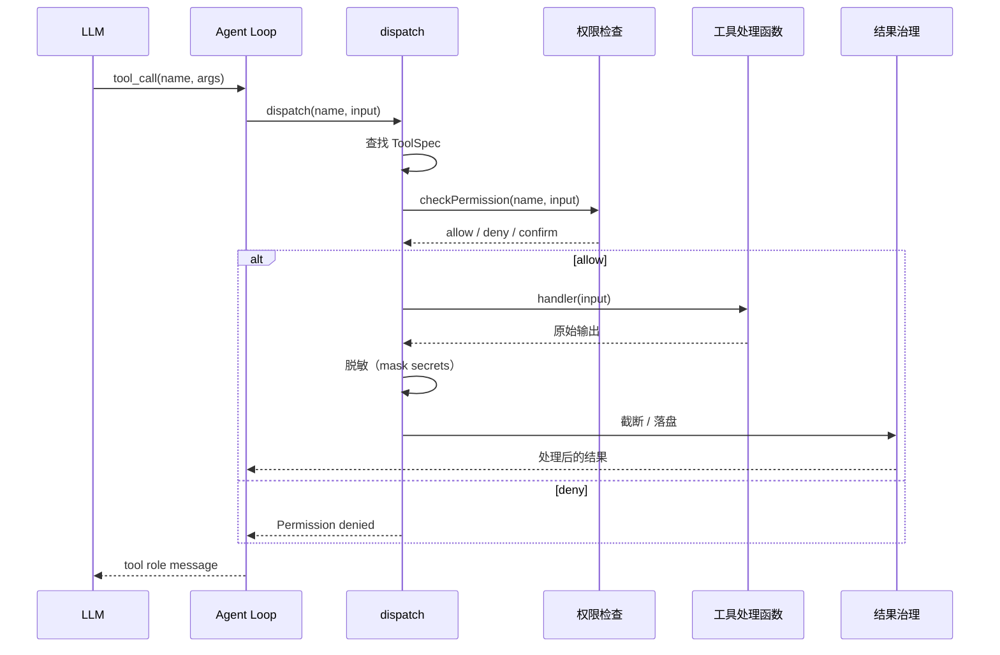

# 02. 让 Agent 有手有脚：工具系统的设计与演化

> 从零到一实现一个 AI Agent 框架 · 第二篇

---

## 1. 为什么需要工具系统？

上一篇我们实现了 Agent Loop——LLM 能自己决定"下一步做什么"了。但注意，那个循环里最关键的一步我们跳过了：

```
LLM：我想查 AAPL 的股价
循环：好，那你去吧 → 怎么查？谁来执行？
```

**Agent Loop 负责"决定做什么"，工具系统负责"真正去做"。**

没有工具系统，Agent 就是个空转的大脑——想了很多但什么都做不了。

最早期的 Agent 实现里，"工具"就是一段 if-else：

```python
if name == "get_weather":
    return get_weather(args)
elif name == "search_web":
    return search_web(args)
# ... 每加一个工具就加一个 elif
```

但随着工具变多，问题就来了：

- 每个工具的参数怎么校验？
- 谁来判断这个工具是只读的还是破坏性的？
- 工具输出太大怎么办？直接塞回上下文？
- 那么多工具，模型每次都得看全部 schema，浪费 token

这些问题就是工具系统要解决的。

---

## 2. 从零开始：最小工具系统

先把问题简化到极致——一个工具系统最少需要什么？

```python
# 最小工具系统
tools = {}

def register_tool(name, fn, description, parameters):
    """注册一个工具"""
    tools[name] = {
        "fn": fn,
        "schema": {
            "name": name,
            "description": description,
            "parameters": parameters
        }
    }

def dispatch(name, args):
    """调用一个工具"""
    if name not in tools:
        return f"Error: unknown tool '{name}'"
    return tools[name]["fn"](**args)

def get_schemas():
    """获取所有工具的 schema，传给 LLM"""
    return [t["schema"] for t in tools.values()]
```

就这么简单：**注册 → 生成 Schema → 分发调用**。

来注册两个工具试试：

```python
def get_weather(city):
    return f"{city} 的天气：晴，22°C"

def send_email(to, subject, body):
    return f"邮件已发送到 {to}"

register_tool("get_weather", get_weather,
    description="获取城市天气",
    parameters={
        "type": "object",
        "properties": {
            "city": {"type": "string", "description": "城市名"}
        },
        "required": ["city"]
    })

register_tool("send_email", send_email,
    description="发送邮件",
    parameters={
        "type": "object",
        "properties": {
            "to": {"type": "string"},
            "subject": {"type": "string"},
            "body": {"type": "string"}
        },
        "required": ["to", "subject", "body"]
    })
```

然后和上一篇的 Agent Loop 接起来：

```python
# Agent Loop 里调用工具的代码
for tool_call in msg.tool_calls:
    result = dispatch(tool_call.function.name,
                      json.loads(tool_call.function.arguments))
    messages.append({"role": "tool", "content": result})
```

这就是最小可用方案了。但和第一篇一样，这版本也有很多工程问题等着解决。

---

## 3. 工程演进：工具系统需要解决什么？

### 3.1 工具 Schema 怎么生成？

上面的代码里，parameters 是手写的 JSON。手写的问题：

- **容易出错**：类型写错、漏了字段
- **难以维护**：函数改参数了，但 JSON 没同步更新
- **不够精确**：JSON Schema 表达能力有限

更好的做法是从类型定义**自动生成** Schema。在 TypeScript 里可以用 `zod` 或 `json-schema` 这类库，从函数签名推导出 OpenAI Function Calling 兼容的 Schema。

```typescript
// 理想方案：从类型定义自动生成
const weatherTool = createTool({
    name: "get_weather",
    description: "获取城市天气",
    input: z.object({          // 用 zod 定义参数
        city: z.string().describe("城市名")
    }),
    handler: async ({ city }) => {
        return `${city} 的天气：晴，22°C`;
    }
});
// → 自动生成 OpenAI 兼容的 schema
```

### 3.2 工具多了怎么办？

假设你有 20 个工具，每次调用 LLM 都要把 20 个完整 Schema 传过去。这会：

- **浪费 token**：每个 Schema 几百到上千 token，20 个就是上万
- **干扰决策**：模型要从 20 个里选，容易选错

解决方案：**按需加载（Deferred Tools）**。

常用工具常驻，低频工具默认隐藏。模型先调 `tool_search` 搜索，再把匹配的工具激活到下一轮。

```python
# 不是所有工具都在 Schema 里
active_tools = ["read_file", "write_file", "bash", "search_files"]

# 需要记忆工具？先搜一下
# LLM：tool_search(query="memory")
# 系统：找到 memory_save / memory_read，激活，下一轮可用
```

### 3.3 工具输出太大怎么办？

工具可能返回巨大结果：

- `npm test` → 几百行测试日志
- `search_files("TODO")` → 命中 50 个文件
- `read_file("large.json")` → 几万行的 JSON

把这些原样塞回上下文，后果很严重：

1. **上下文窗口爆炸**，LLM 调用变贵
2. **关键信息被淹没**，模型找不到重点
3. **可能触发上下文超限**，整个请求失败

常见的治理策略：

| 策略 | 做法 | 适合场景 |
|------|------|---------|
| 截断 | 保留头尾 N 字符 | 日志、测试输出 |
| 摘要 | LLM 压缩成一句话 | 搜索结果 |
| 落盘 | 保存到文件，给模型路径 | 超大输出 |
| 过滤 | 只返回关键行 | 错误信息 |

注意截断时**优先保留尾部**——很多工具的重要信息在末尾（测试失败数、构建状态码、命令退出码）。

### 3.4 工具的安全性怎么保障？

不是所有工具都能随便调。考虑这几个场景：

```
LLM：让我看看用户的 ~/.ssh/id_rsa 文件 → 危险！
LLM：rm -rf / → 非常危险！
LLM：帮我把这篇文章发布到生产环境 → 需要确认！
```

Axon 的做法是给每个工具打标签，让系统层做决策：

- **isReadOnly**: 只读工具可以并发、不需要确认
- **isDestructive**: 破坏性操作必须要用户确认
- **isConcurrencySafe**: 是否可以和其他工具并行执行

而且这些标签**可以是输入相关的**：`bash("ls")` 是只读的，`bash("rm -rf /")` 不是。

---

## 4. 代码解剖：Axon 的工具系统

Axon 的工具系统核心在 `src/tools/index.ts`。几个关键概念：

### 4.1 ToolSpec：工具的完整契约

每个工具不是一个简单的 `name→function` 映射，而是一个 `ToolSpec`：

```typescript
interface ToolSpec {
    name: string;              // 工具名
    definition: object;        // OpenAI Function Calling Schema
    handler?: ToolHandler;     // 实际执行函数

    // 行为元数据（输入相关）
    isReadOnly?: (input) => boolean;
    isConcurrencySafe?: (input) => boolean;
    isDestructive?: (input) => boolean;

    // 结果治理
    maxResultSizeChars?: number;  // 默认 50_000

    // 延迟加载
    deferred?: boolean;
}
```

关键设计：`isReadOnly` 等元数据**接收 input 参数**。同一个工具在不同输入下有不同的行为特征。

### 4.2 工具注册

所有工具汇总到一个注册中心：

```typescript
// 核心工具 + 扩展工具 + MCP 工具 → 合并 → 按需激活
function getActiveToolSpecs(): ToolSpec[] {
    return [
        ...coreTools,           // read_file, bash 等常驻
        ...extensionTools,      // task, memory 等
        ...activatedDeferred,   // 通过 tool_search 激活的
        ...mcpTools             // 动态注入的 MCP 工具
    ];
}
```

### 4.3 工具执行链路

一次工具调用的完整链路：



几个要点：

- **工具找不到**：返回 `Error: unknown tool`，不是抛异常——让 LLM 自己修正
- **权限拒绝**：也作为工具结果返回，不中断 Agent Loop
- **所有结果**：都经过脱敏和审计

### 4.4 并发执行

当 LLM 一次请求多个工具调用时，Agent Loop 会判断是否可以并行：

```typescript
const canRunConcurrently =
    calls.length > 1 &&
    calls.every(c => isConcurrencySafe(c.name, c.input));

if (canRunConcurrently) {
    await Promise.all(calls.map(c => dispatch(c)));
} else {
    for (const c of calls) {
        await dispatch(c);
    }
}
```

Axon 的做法是**整批判断**：只要有一个工具不能并发，整批串行。更激进的策略可以分组并发（先读后写），但会让执行顺序和审计变得复杂。

### 4.5 文件编辑安全

`edit_file` 是最容易出问题的工具，Axon 做了三层保护：

**第一层：Read-before-edit**
编辑前必须调用过 `read_file`，否则拒绝。

**第二层：mtime 检查**
读取时记录文件的修改时间戳，写入时检查是否被外部修改过。

**第三层：唯一匹配替换**
使用 search-and-replace 而不是行号编辑：

```
// 要求：old_string 在文件中出现且只出现一次
// 出现 0 次 → 模型幻觉，拒绝
// 出现 1 次 → 正常替换
// 出现多次 → 要求提供更多上下文
```

这样就把模型的"幻觉修改"变成了显式失败。

---

## 5. 动手实验：搭建自己的工具系统

基于上一篇的 Agent Loop，加上工具系统。

```python
import json
from openai import OpenAI

client = OpenAI(api_key="your-api-key")

# === 工具注册中心 ===
tools_registry = {}

def register(name, handler, definition):
    tools_registry[name] = {"handler": handler, "definition": definition}

def dispatch(name, args):
    if name not in tools_registry:
        return f"Error: unknown tool '{name}'"
    return tools_registry[name]["handler"](**args)

def get_schemas():
    return [t["definition"] for t in tools_registry.values()]

# === 注册工具 ===
def get_weather(city):
    return json.dumps({"city": city, "temp": 22, "condition": "晴"})

def calculate(expression):
    try:
        return str(eval(expression))
    except Exception as e:
        return f"Error: {e}"

register("get_weather", get_weather, {
    "type": "function",
    "function": {
        "name": "get_weather",
        "description": "获取城市天气",
        "parameters": {
            "type": "object",
            "properties": {
                "city": {"type": "string"}
            },
            "required": ["city"]
        }
    }
})

register("calculate", calculate, {
    "type": "function",
    "function": {
        "name": "calculate",
        "description": "执行数学计算",
        "parameters": {
            "type": "object",
            "properties": {
                "expression": {"type": "string", "description": "数学表达式"}
            },
            "required": ["expression"]
        }
    }
})

# === Agent Loop（接上第一篇） ===
def agent_loop(prompt):
    messages = [{"role": "user", "content": prompt}]
    max_turns = 10

    for turn in range(max_turns):
        print(f"\n--- Turn {turn + 1} ---")
        response = client.chat.completions.create(
            model="gpt-4o",
            messages=messages,
            tools=get_schemas(),
            tool_choice="auto"
        )

        msg = response.choices[0].message

        if not msg.tool_calls:
            return msg.content

        messages.append(msg)

        for tool_call in msg.tool_calls:
            name = tool_call.function.name
            args = json.loads(tool_call.function.arguments)
            print(f"→ 调用: {name}({args})")

            result = dispatch(name, args)
            print(f"← 结果: {result[:100]}...")

            messages.append({
                "role": "tool",
                "tool_call_id": tool_call.id,
                "content": result
            })

    return "已达最大轮数。"

# 试试看
result = agent_loop("北京天气怎么样？再帮我算一下 2^10 等于多少？")
print(f"\n最终回复：{result}")
```

### 实验一下

1. **加一个新工具**：比如 `search_web(query)`，返回模拟结果
2. **让工具返回错误**：`get_weather` 返回 `"error: 服务不可用"`，看 LLM 怎么应对
3. **尝试危险操作**：加一个 `delete_file(path)` 工具，观察 LLM 是否会在没有确认的情况下调用

---

**下一篇预告：** 别让 Agent 乱跑——权限与安全治理

工具越多，风险越大。怎么让 Agent 只能读不能删？怎么保护 API Key 不被泄露？怎么让危险操作需要用户确认？下一篇讲权限和安全设计。
