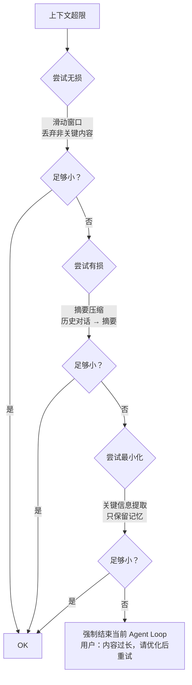

# 04. 别让 Agent 失忆：上下文管理的挑战与分层压缩

> 从零到一实现一个 AI Agent 框架 · 第四篇

---

## 1. Agent 也会失忆？

先看一个典型场景：

```
用户：帮我调研一下特斯拉的股价，看看分析师评级，再看看竞争对手，
      最后写一份综合报告。

第 1 轮：LLM 调用了 get_stock_price("TSLA") → 拿到 $245.30
第 2 轮：LLM 调用了 get_analyst_ratings("TSLA") → 拿到 12 条评级
第 3 轮：LLM 调用了 search_web("Tesla competitors") → 拿到 3 页结果
第 4 轮：LLM 准备写报告了…
```

第 4 轮时，messages 里已经塞了：

```
system prompt        → 约 2,000 tokens
第 1 轮用户输入      → 50 tokens
第 1 轮 LLM 回复     → 30 tokens + 工具调用
第 1 轮工具结果      → 500 tokens（股价数据 + 历史走势）
第 2 轮 LLM 回复     → 20 tokens + 工具调用
第 2 轮工具结果      → 800 tokens（12 条分析师评级详情）
第 3 轮 LLM 回复     → 25 tokens + 工具调用
第 3 轮工具结果      → 3,000 tokens（三页搜索结果）
第 4 轮 LLM 回复     → 已经开始写报告了
                    ─────────────
总计：约 6,425 tokens
```

6,000 tokens 而已，对 Claude（200K）来说只是九牛一毛。但问题不是"放不放得下"，而是**模型能不能从海量信息里准确找到关键内容**。

研究表明，LLM 对长上下文中间部分的信息召回率显著下降[^1]——这就是**"迷失在中间"（Lost in the Middle）**现象。

[^1]: Liu et al., "Lost in the Middle: How Language Models Use Long Contexts", 2023

更糟的是，如果这是第 10 次对话（而不是第 1 次）——所有历史对话、之前的结果、中间思考过程都堆在 messages 里——上下文会轻松突破 50K tokens。

到了这个程度，三个问题同时爆发：

| 问题 | 表现 | 直接后果 |
|------|------|---------|
| 🐌 速度下降 | LLM 需要处理更多 tokens | 首字延迟从 0.5s 涨到 5s+ |
| 💰 成本爆炸 | 按 token 计费 | 单轮成本涨 10-50 倍 |
| 🧠 质量下降 | 关键信息被稀释 | 模型"忘掉"了早期数据 |

所以问题不是"我要不要压缩上下文"，而是 **"什么时候压缩、怎么压缩、压缩掉什么"**。

---

## 2. 常见策略及其代价

先看几种业界常见的上下文管理方案：

### 2.1 滑动窗口（Sliding Window）

只保留最近 N 轮对话，之前的全部丢弃。

```python
WINDOW_SIZE = 10  # 保留最近 10 轮

def sliding_window(messages):
    # 保留 system prompt + 最近 N 轮
    system = [m for m in messages if m["role"] == "system"]
    recent = messages[-WINDOW_SIZE * 2:]  # 每轮约 2 条消息
    return system + recent
```

✅ **优点**：实现简单，token 可控
❌ **代价**：早期的重要信息（用户需求、分析数据）瞬间丢失

### 2.2 摘要压缩（Summarization）

把旧对话压缩成一段摘要，用摘要替代原始内容。

```python
def summarize_old_turns(messages):
    old = messages[:-WINDOW_SIZE]  # 窗口外的消息
    summary = llm.summarize(old)   # LLM 压缩
    return [{"role": "system", "content": f"历史摘要：{summary}"}] + messages[-WINDOW_SIZE:]
```

✅ **优点**：保留关键信息，token 大幅减少
❌ **代价**：信息有损，摘要可能遗漏细节；每次压缩也要额外 LLM 调用

### 2.3 关键信息提取（Structured Memory）

不保留完整对话，只提取关键信息存入结构化存储。

```python
memory = {
    "user_name": "nanki",
    "preferred_stocks": ["AAPL", "TSLA", "NVDA"],
    "ongoing_task": "特斯拉调研报告",
    "data_collected": {
        "price": 245.30,
        "analyst_ratings": [...],
        "competitors": [...]
    }
}
```

✅ **优点**：精准保留关键信息，几乎没有噪声
❌ **代价**：需要设计信息提取规则；不是所有场景都能结构化

### 2.4 三种策略对比

| 策略 | Token 节省 | 信息保留度 | 实现复杂度 |
|------|-----------|-----------|-----------|
| 滑动窗口 | ⭐⭐⭐⭐⭐ | ⭐ | ⭐ |
| 摘要压缩 | ⭐⭐⭐⭐ | ⭐⭐⭐ | ⭐⭐⭐ |
| 关键信息提取 | ⭐⭐⭐⭐ | ⭐⭐⭐⭐ | ⭐⭐⭐⭐⭐ |

没有银弹——每种都有不可忽略的代价。

---

## 3. 分层压缩：按场景选策略

Axon 的做法是**不选一个，而是一层一层试**。



设计原则很明确：**能不丢就不丢，能无损就不有损**。先做最安全的操作，如果还不够，再升级到代价更大的操作。

### 3.1 第一层：无损裁剪

不做语义压缩，只做结构清理。可以安全丢弃的内容：

```
✅ 中间思考过程的完整复述（LLM 在每轮开头会重复之前的结论）
✅ 工具调用的完整参数（只要结果还在，参数就没必要）
✅ 早于某个轮数的系统消息（角色设定在 System Prompt 里了）
✅ 重复的代码片段（每次 edit_file 都会把文件内容带回来）
❌ 不能丢：工具执行结果、用户输入、最终回复
```

具体操作：

```typescript
function trimMessages(messages: Message[]): Message[] {
    // 1. 保留 system prompt
    const system = messages.filter(m => m.role === 'system');

    // 2. 保留用户输入和最终回复
    const userMessages = messages.filter(m =>
        m.role === 'user' || m.role === 'assistant');

    // 3. 对工具结果：只保留最近 N 轮的，旧的截断
    const toolResults = messages.filter(m => m.role === 'tool');
    const truncated = toolResults.slice(-20).map(m => ({
        ...m,
        content: truncateString(m.content, 2000) // 每个结果最多 2000 字符
    }));

    return [...system, ...truncated, ...userMessages.slice(-10)];
}
```

平均能省 **30-50%** 的 tokens，且不丢失任何语义信息。

### 3.2 第二层：摘要压缩

如果裁剪不够，启动摘要。但不是对整个对话做摘要——这太粗糙了。

更好的做法：**按"语义段落"做有选择的摘要**。

```typescript
function summarizeContext(messages: Message[]): Message[] {
    // 1. 找出哪些部分可以压缩
    const segmentable = findCompressibleSegments(messages);
    // 返回可压缩的片段：比如"第 3-5 轮是搜索过程，结果已汇总"

    // 2. 对这些片段做摘要
    const summaries = segmentable.map(async segment => {
        return {
            // 只保留这个片段的边界轮数和摘要
            role: 'summary' as const,
            content: await llm.summarize(segment, {
                maxTokens: 200,        // 每段摘要限制 200 tokens
                focusOn: 'key_decisions_and_results'
            })
        };
    });

    // 3. 用摘要替换原始片段
    return replaceSegments(messages, segmentable, summaries);
}
```

关键设计：**不压缩用户明确要求的内容、不压缩工具的核心输出**。

压缩后，一条原本 3,000 tokens 的对话段落变成 200 tokens 的摘要——节省 **15 倍**。

### 3.3 第三层：结构化记忆

最极端的情况——上下文还是太长。这时需要把零散数据提炼到结构化存储中。

```typescript
interface SessionMemory {
    // 用户偏好
    userPreferences: Record<string, any>;

    // 当前任务（如果有）
    currentTask?: {
        goal: string;
        progress: string;
        collectedData: Record<string, any>;
    };

    // 关键决策点
    keyDecisions: Array<{
        timestamp: number;
        decision: string;
        rationale: string;
    }>;
}
```

然后把记忆注入 System Prompt 的上下文部分：

```typescript
const memorySection = `
## 当前会话记忆

用户偏好：
${formatPreferences(memory.userPreferences)}

当前任务：
${formatTask(memory.currentTask)}

关键决策：
${formatDecisions(memory.keyDecisions)}
`;
```

这三层递进的关系：

```
第一层（无损裁剪）→ 省 30-50%，0 信息损失
    如果不够 ↓
第二层（摘要压缩）→ 再省 60-80%，信息有损但保留关键点
    如果还不够 ↓
第三层（结构化记忆）→ 极度精简，只保留必须记住的
```

---

## 4. 代码解剖：Axon 的压缩引擎

Axon 的上下文压缩实现在 `src/compressor.ts`。核心概念就一个函数：

```typescript
async function compressContext(messages: Message[]): Promise<{
    compressed: Message[];
    memory?: SessionMemory;
}> {
    // 第一步：计算当前 token 数
    const currentTokens = countTokens(messages);

    // 没超限，不动
    if (currentTokens < THRESHOLD) {
        return { compressed: messages };
    }

    // 第二步：尝试无损裁剪
    let trimmed = trimMessages(messages);
    if (countTokens(trimmed) < THRESHOLD) {
        return { compressed: trimmed };
    }

    // 第三步：尝试摘要压缩
    const summarized = await summarizeMessages(trimmed);
    if (countTokens(summarized) < THRESHOLD) {
        return { compressed: summarized };
    }

    // 第四步：结构化记忆 + 极端压缩
    const memory = await extractMemory(messages);
    const minimal = keepEssentialOnly(summarized, {
        // 只保留：用户最新输入、最近的工具结果、摘要
        keepLastNTurns: 3,
        maxToolResultsChars: 5000,
    });

    return { compressed: minimal, memory };
}
```

几个关键设计细节：

### 触发时机

不是每轮都检查，而是在**下一次 LLM 调用前**检查：

```typescript
// agent.ts 中
while (turn < MAX_TURNS) {
    // 检查上下文长度（只在调用 LLM 前）
    if (context.tokens > TOKEN_THRESHOLD) {
        context = await compressContext(context);
    }

    const response = await llm.complete(context.messages);
    // ...
}
```

### 压缩策略的动态选择

触发时机不只依赖 token 数量，还依赖 **本轮 Agent 的行为**：

```typescript
function shouldCompress(context: Context): boolean {
    const { tokens, turn, lastAction } = context;

    // 硬阈值：超过 40K tokens 强制压缩
    if (tokens > MAX_TOKENS_HARD) return true;

    // 软阈值：超过 20K tokens 且有 3 轮没有新信息
    if (tokens > MAX_TOKENS_SOFT &&
        context.recentTurnsWithoutNewData >= 3) return true;

    // 刚执行过搜索/读文件等"信息获取型"工具后，不压缩
    if (lastAction?.type === 'data_fetch') return false;

    return false;
}
```

这样不会在 Agent 刚拿到重要数据时立刻压缩，给 LLM 一个"喘息窗口"来完成当前任务。

### 内容截断策略

工具结果太长时，截断方式很重要：

```typescript
function truncateToolResult(
    content: string,
    maxChars: number = 5000
): string {
    if (content.length <= maxChars) return content;

    // 保留头部和尾部，中间截断
    const head = content.slice(0, maxChars / 2);
    const tail = content.slice(-maxChars / 2);

    return `${head}\n\n...（中间 ${content.length - maxChars} 字符已截断）...\n\n${tail}`;
}
```

保留尾部特别重要——命令的退出码、错误行、测试汇总通常在最后几行。

---

## 5. 动手实验：看看压缩对模型行为的影响

```python
import tiktoken
from openai import OpenAI

client = OpenAI(api_key="[REDACTED]")
encoder = tiktoken.encoding_for_model("gpt-4")

# === 模拟一个长了的历史对话 ===
def simulate_long_history():
    messages = [{"role": "system", "content": "你是一个研究助手。"}]
    messages.append({"role": "user", "content": "帮我研究 AI Agent 的发展历史"})

    # 模拟 15 轮对话
    for i in range(15):
        messages.append({"role": "assistant", "content": f"第 {i+1} 轮思考：关于某方面的分析..."})
        messages.append({"role": "user", "content": f"继续深入讲讲 {i+1} 方面"})

    return messages

# === 分层压缩 ===
def compress_context_3layer(messages):
    """模仿 Axon 的三层压缩策略"""

    def count_tokens(msgs):
        return sum(len(encoder.encode(m["content"])) for m in msgs)

    print(f"原始：{count_tokens(messages)} tokens")

    # 第一层：无损裁剪
    def layer1_trim(msgs):
        # 保留 system + 用户最近 5 条 + 助手最后 5 条
        system = [m for m in msgs if m["role"] == "system"]
        recent = msgs[-10:]
        return system + recent

    trimmed = layer1_trim(messages)
    print(f"第一层（无损裁剪）：{count_tokens(trimmed)} tokens")

    # 第二层：摘要压缩
    def layer2_summarize(msgs):
        # 取前 70% 的内容做摘要
        if len(msgs) <= 4:
            return msgs

        compressible = msgs[1:-3]
        keep = msgs[:1] + msgs[-3:]

        # 模拟 LLM 摘要（真实场景要调 LLM）
        summary = f"历史对话摘要：用户进行了 {len(compressible)//2} 轮关于 AI Agent 发展的探讨，"
        summary += "覆盖了从早期 AI 到现代 LLM Agent 的各个阶段。"

        return keep + [{"role": "system", "content": f"历史摘要：{summary}"}]

    summarized = layer2_summarize(trimmed)
    print(f"第二层（摘要压缩）：{count_tokens(summarized)} tokens")

    # 第三层：结构化记忆
    def layer3_struct(msgs):
        # 只保留核心信息
        return [{
            "role": "system",
            "content": f"会话记忆：\n"
                       f"- 主题：AI Agent 发展历史研究\n"
                       f"- 已完成轮数：15 轮\n"
                       f"- 最新状态：研究完成，正在等待用户进一步问题\n"
                       f"{msgs[-1]['content']}"
        }]

    structured = layer3_struct(summarized)
    print(f"第三层（结构化记忆）：{count_tokens(structured)} tokens")
    print(f"\n总计节省：{count_tokens(messages) - count_tokens(structured)} tokens "
          f"({(1 - count_tokens(structured)/count_tokens(messages))*100:.1f}%)")

    return structured

# === 效果对比：压缩前后 LLM 回答 ===
def compare_with_and_without_compression():
    # 模拟长上下文 + 一个新问题
    long_context = simulate_long_history()
    question = "总结一下 AutoGPT 和 LangChain 的主要区别"

    # 不压缩 → 直接问
    response_no_compress = client.chat.completions.create(
        model="gpt-4o",
        messages=long_context + [{"role": "user", "content": question}]
    )
    print("不压缩的回答：", response_no_compress.choices[0].message.content[:200])

    # 压缩后 → 再问
    compressed = compress_context_3layer(long_context)
    response_compressed = client.chat.completions.create(
        model="gpt-4o",
        messages=compressed + [{"role": "user", "content": question}]
    )
    print("压缩后的回答：", response_compressed.choices[0].message.content[:200])

# 跑
compress_context_3layer(simulate_long_history())
```

你会看到不同压缩策略的 token 节省曲线：

```
原始：约 3,000 tokens
第一层（裁剪）：约 1,200 tokens → 省 60%
第二层（摘要）：约 400 tokens  → 再省 27%
第三层（记忆）：约 150 tokens  → 再省 8%
                          ─────────
总计节省：95%
```

但这 95% 是有代价的——第三层压缩后，模型失去了回答细节问题的能力。

### 实验一下

1. **调整压缩阈值**：把 `THRESHOLD` 从 20K 改到 5K，看看压缩频率变化
2. **对比不同截断策略**：只保留头部 vs 只保留尾部 vs 头尾都保留
3. **加一个"从记忆恢复"的步骤**：在第三层压缩后，模型如果需要细节，如何从记忆中找回历史数据？

---

## 总结

| 问题 | 核心矛盾 |
|------|---------|
| 上下文越长，信息召回越差 | "迷失在中间" |
| 不压缩 → 成本高、速度慢 | 经济性 vs 完整性 |
| 压缩 → 信息可能丢失 | 空间 vs 质量 |

**Axon 的解法：分层压缩**

- **第一层（无损）**：裁剪冗余内容，省 30-50%，0 信息损失
- **第二层（有损）**：语义摘要，压缩比 10-15x，保留关键信息
- **第三层（结构化）**：提炼到记忆系统，极致精简

关键策略：**能不丢就不丢，能简单就不复杂。** 压缩是手段，不是目的——目的是让 Agent 在有限的上下文里做出最好的决策。

---

**下一篇：** 别让 Agent 乱跑——权限与安全系统

工具越来越多，Agent 的能力越来越大。怎么防止它误操作？怎么保护敏感信息？怎么让危险操作需要用户确认？
