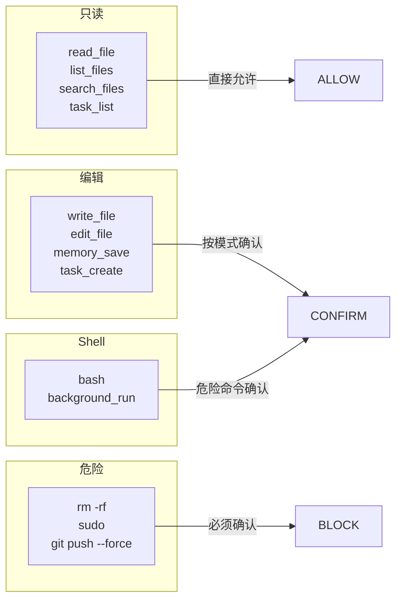
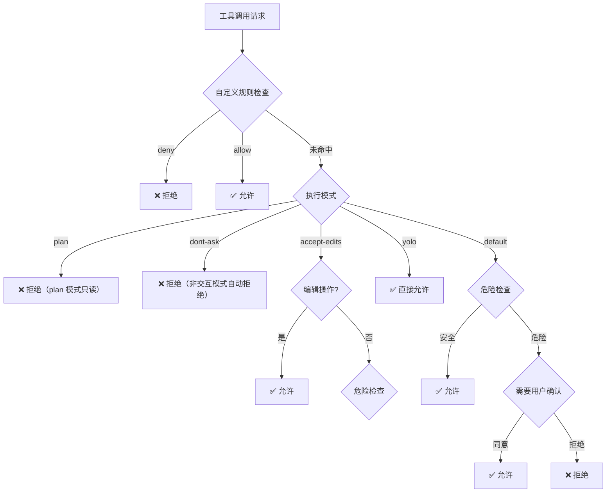
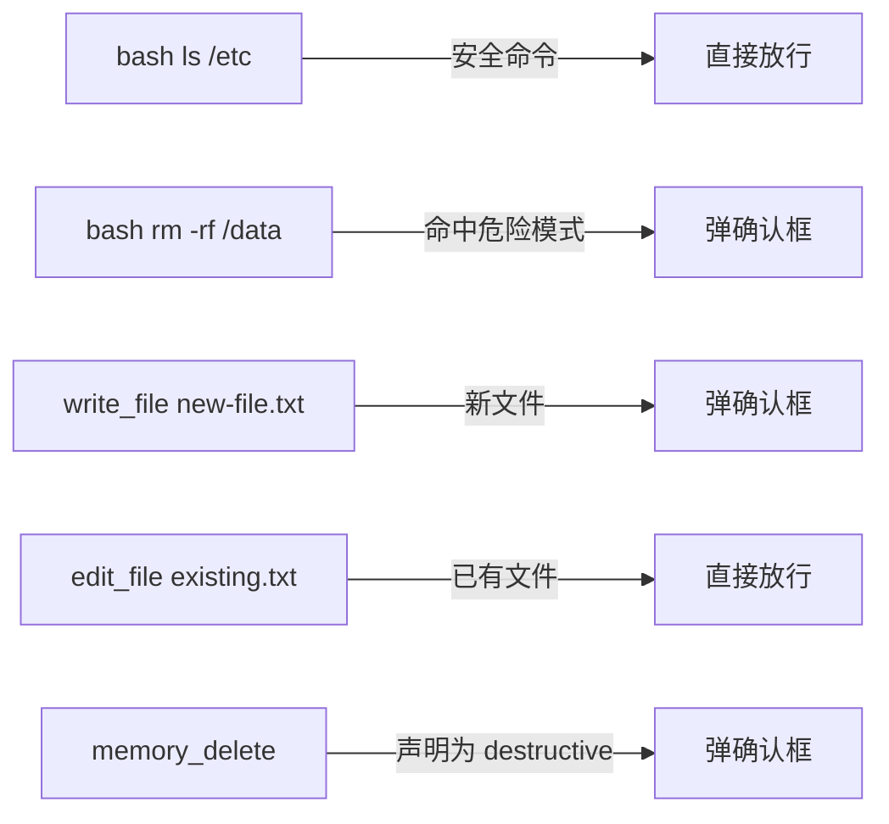
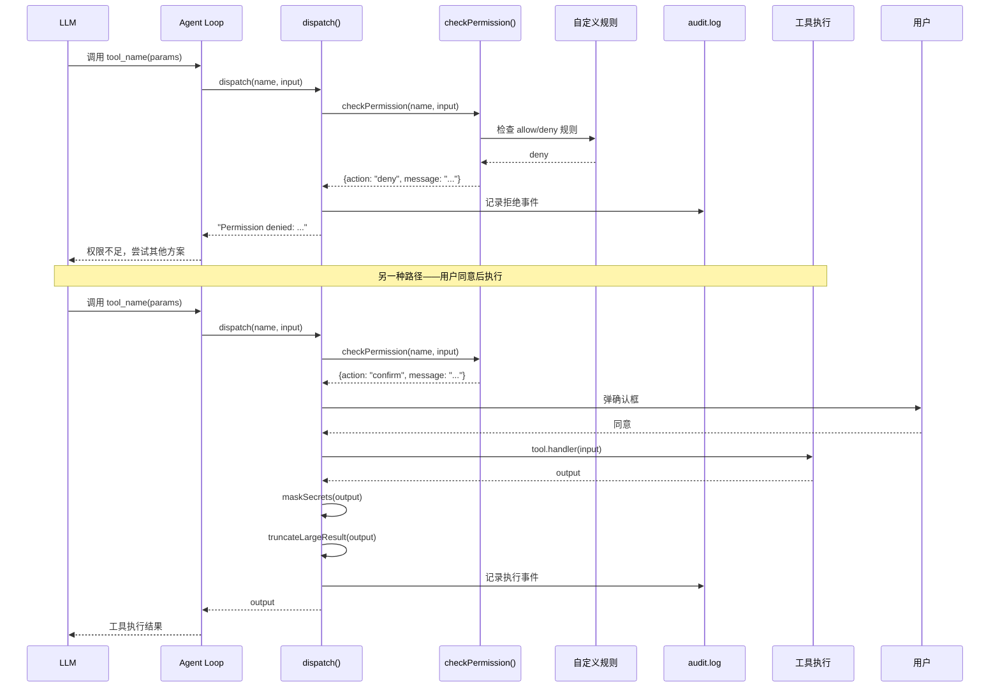

# 05. 别让 Agent 乱跑：权限系统与安全防线

> 从零到一实现一个 AI Agent 框架 · 第五篇

---

## 1. 当 Agent 什么都能做时

回来一段简单场景。

你给了 Agent 一个需求：把项目部署到服务器。

Agent 很能干，它会想：

```
1. ls -la /etc/nginx/          → 看配置
2. scp dist/ user@server:~/   → 上传文件
3. ssh user@server -- "rm -rf /var/www/*"  → 清空旧文件
```

前两步还好。第三步 — `rm -rf` — 灾难来了。如果是线上环境，正确的路径应该是 `/var/www/old-site/*`，但 Agent 写成了 `/var/www/*`。或者更糟，它理解了你的意图但系统上下文太多，误删了不该删的目录。

**Agent 本身没有恶意。它只是"听话"——太听话了。**

这就引出了权限系统的核心问题：**怎么让 Agent 能干活，又不让它干坏事？**

### 1.1 Agent 安全模型 vs 传统安全模型

传统软件的安全模型很清晰：用户 → 操作系统权限 → 程序。

```
用户运行程序 → 程序有固定权限（读/写/执行）
              → 权限在安装时确定，运行时不变
              → 程序不能自行升级权限
```

Agent 的安全模型完全不同：

```
用户给 Agent 一个意图 → Agent 决定用什么工具 → 工具调用的参数由 LLM 决定
                    → 下一次调用的参数取决于上一次的结果
                    → 参数是动态的、不可预测的
```

关键差异：**传统程序的权限是静态的、可穷举的；Agent 的权限是动态的、参数由模型实时生成的。**

举个例子，一个传统 CGI 脚本的 `rm` 操作，写死在哪一行、删什么路径，代码审核时可以看清楚。但 Agent 的 `rm` 调用，参数是它现场编的——每次都可能不一样。

这就是为什么 Agent 框架需要一套全新的权限设计。

---

## 2. 基础：四种操作类型

先给所有工具分个类。这是安全设计的第一步。



Axon 用三个集合来归类工具：

```typescript
// src/permissions.ts

// 只读工具 —— 永远安全，直接放行
const READ_TOOLS = new Set([
    "read_file", "list_files", "search_files",
    "skill_list", "skill_read",
    "task_list", "check_background",
    "memory_list", "memory_read",
]);

// 编辑工具 —— 写入类操作，按策略放行或确认
const EDIT_TOOLS = new Set([
    "write_file", "edit_file",
    "memory_save", "memory_delete",
    "task_create", "task_update", "task_delete",
    // ...
]);

// Shell 工具 —— 变长参数，最危险
const SHELL_TOOLS = new Set(["bash", "background_run"]);
```

这三个集合决定了**默认行为**：

| 类型 | 默认策略 | 理由 |
|------|---------|------|
| 只读 | ✅ 直接允许 | 读文件和搜索不改变系统状态 |
| 编辑 | ⚠ 按模式确认 | 写新文件需要确认，编辑已有文件可以自动放行 |
| Shell | ⚠ 危险命令确认 | 根据命令内容动态判断风险级别 |

### 2.1 什么是"危险命令"？

不是所有 Shell 命令都需要确认。`ls`、`cat`、`pwd` 这些明显安全——但判断不能靠直觉，要有一个明确的规则列表。

Axon 的思路是**黑名单模式**：

```typescript
const DANGEROUS_COMMAND_PATTERNS = [
    /\brm\s+(-[^\s]*[rf][^\s]*|.*\*)/,     // rm -rf 或 rm 通配符
    /\bsudo\b/,                               // 提权
    /\bgit\s+(push|reset|clean|checkout\s+\.|branch\s+-D)\b/,  // git 写操作
    /\bchmod\s+(-R\s+)?777\b/,               // 改权限
    /\bcurl\b.*\|\s*(bash|sh)\b/,            // 管道执行远程脚本
    /\bnpm\s+install\b/,                      // 装依赖（可能是供应链攻击）
    /\bkill(all)?\b/,                          // 杀进程
    /\breboot\b/,                              // 重启
    // ...
];
```

判断逻辑很简单：

```typescript
function isDangerousCommand(command: string): boolean {
    return DANGEROUS_COMMAND_PATTERNS.some(pattern => pattern.test(command));
}
```

**设计哲学：宁可多拦截，不可放过。** 用户如果确定安全，可以在 settings.json 里加到 allow 列表。误报比漏报好得多。

---

### 2.2 ToolSpec 元数据

除了全局分类，每个工具还可以在注册时声明自己的安全属性：

```typescript
interface ToolSpec {
    name: string;
    definition: object;
    handler?: ToolHandler;

    // 安全元数据
    isReadOnly?: (input: ToolInput) => boolean;
    isDestructive?: (input: ToolInput) => boolean;
    isConcurrencySafe?: (input: ToolInput) => boolean;
}
```

注册时通过工厂函数设定：

```typescript
// 只读工具 —— readOnly() 自动设置
readOnly(READ_DEFINITION, (i) => readFile(i.path))

// 普通工具 —— 默认需要确认
spec(WRITE_DEFINITION, (i) => writeFile(i.path, i.content))

// 明确声明危险操作
spec(MEMORY_DELETE_DEFINITION, handler, {
    isDestructive: () => true,
    deferred: true,
})

// Shell 命令 —— isReadOnly 动态判断
spec(BASH_DEF, (i) => bashExecute(i.command), {
    isReadOnly: (i) => /^\s*(ls|cat|pwd|...)\b/.test(String(i.command ?? "")),
})
```

这比全局分类更精细：`isReadOnly` 可以是动态函数，根据参数决定是否安全。

---

## 3. 核心：策略链（Policy Chain）

光有分类不够——不同用户、不同场景下需要的严格程度完全不同。

个人开发机上，你可能想完全信任 Agent："放手干，我盯着就行。"

CI/CD 流水线上，你需要完全拒绝所有写入："只准读，不准改。"

团队协作时，你可能想要中间方案："写文件可以，但别碰 `production.yaml`。"

Axon 用**策略链**来处理这种多样性：



核心函数 `checkPermission` 就是这个链的串联：

```typescript
export function checkPermission(
    toolName: string,
    input: Record<string, any>,
    mode: Mode,
    metadata: ToolPermissionMetadata,
): PermissionDecision {
    // 第一关：自定义规则（权限最优先）
    const ruleResult = checkPermissionRules(toolName, input);
    if (ruleResult === "deny")  return { action: "deny", message: "..." };
    if (ruleResult === "allow") return { action: "allow" };

    // 第二关：执行模式
    if (mode === "yolo") return { action: "allow" };
    if (mode === "plan") {
        if (isShellLike) return { action: "deny" };
        if (isReadOnly)  return { action: "allow" };
        return { action: "deny" };
    }

    // 第三关：操作类型分类
    if (isReadOnly) return { action: "allow" };
    if (isEditLike && !isDestructive && mode === "accept-edits") return { action: "allow" };

    // 第四关：危险评估，确认或拒绝
    if (isDangerous || isDestructive) return { action: "confirm", message };
    return { action: "allow" };
}
```

### 3.1 用户自定义规则（最优先）

策略链里，自定义规则的优先级最高——用户可以覆盖框架的默认行为。

规则写在 `.axon/settings.json` 中：

```json
{
    "permissions": {
        "allow": [
            "bash(ls *)",
            "read_file(/Users/*)"
        ],
        "deny": [
            "bash(sudo *)",
            "write_file(*/production.yaml)"
        ]
    }
}
```

规则格式：`工具名(模式)`，模式支持通配符 `*`：

```typescript
function matchesRule(rule, toolName, input): boolean {
    // 工具名匹配（支持通配符 *）
    if (rule.tool !== toolName && rule.tool !== "*") return false;

    // 参数匹配
    if (!rule.pattern) return true;           // 无模式 → 匹配所有
    if (rule.pattern.endsWith("*"))           // 前缀
        return value.startsWith(...);
    if (rule.pattern.includes("*"))           // 通配符
        return new RegExp(...).test(value);
    return value === rule.pattern;            // 精确匹配
}
```

**设计哲学：框架给默认安全策略，用户通过规则覆盖。** 这样既能开箱即用，又能灵活适配。

### 3.2 执行模式

五种执行模式对应不同的安全层级：

| 模式 | 只读 | 编辑 | Shell 安全 | Shell 危险 | 适用场景 |
|------|------|------|-----------|-----------|---------|
| `plan` | ✅ | ❌ 拒绝 | ❌ 拒绝 | ❌ 拒绝 | 仅分析，不执行 |
| `dont-ask` | ✅ | ✅ 自动拒绝 | ✅ 自动拒绝 | ❌ 拒绝 | CI/CD、自动化 |
| `default` | ✅ | ✅ | ✅ | ⚠ 确认 | 日常开发 |
| `accept-edits` | ✅ | ✅ 自动放行 | ✅ | ⚠ 确认 | 代码重构场景 |
| `yolo` | ✅ | ✅ | ✅ | ✅ | 完全信任环境 |

```typescript
// mode.ts
export type Mode = "yolo" | "default" | "plan" | "accept-edits" | "dont-ask";
```

**设计哲学：** 模式是用户对 Agent 信任程度的声明。"我不看，但你别搞事"和"我来盯着，你放手干"需要的是不同的安全策略。

---

## 4. 审计日志：每一件事都记下来

权限拦截是事前的保护。但真正出问题时，你需要的是——**谁在什么时候做了什么**。

Axon 有一个审计日志系统记录每次工具调用：

```typescript
export function auditToolCall(entry: {
    toolName: string;
    input: Record<string, any>;
    decision: PermissionDecision;
    output?: string;
}): void {
    const auditPath = join(getProjectAxonDir(), "security", "audit.log");
    mkdirSync(dirname(auditPath), { recursive: true });

    const line = {
        ts: new Date().toISOString(),
        toolName: entry.toolName,
        input: maskSecrets(JSON.stringify(entry.input)),
        decision: entry.decision.action,
        message: entry.decision.message,
        outputPreview: entry.output
            ? maskSecrets(entry.output).slice(0, 500)
            : undefined,
    };
    appendFileSync(auditPath, JSON.stringify(line) + "\n", "utf-8");
}
```

每条记录包含：

```json
{"ts":"2025-01-15T10:23:45.123Z","toolName":"bash","input":"{\"command\":\"ls -la /etc/\"}","decision":"allow"}
{"ts":"2025-01-15T10:23:47.456Z","toolName":"bash","input":"{\"command\":\"rm -rf /var/www/old\"}","decision":"confirm","message":"bash: rm -rf /var/www/old"}
{"ts":"2025-01-15T10:23:48.789Z","toolName":"write_file","input":"{\"path\":\"/etc/nginx/sites-enabled/default\"}","decision":"allow"}
```

所有敏感信息（API keys、token）输出前会经过 `maskSecrets` 清洗：

```typescript
const SECRET_PATTERNS = [
    /sk-[A-Za-z0-9_-]{16,}/g,              // OpenAI key
    /(api[_-]?key["'\s:=]+)([^"'\s,}]+)/gi, // API key
    /(token["'\s:=]+)([^"'\s,}]+)/gi,       // Token
    /(authorization:\s*bearer\s+)([A-Za-z0-9._-]+)/gi, // Bearer
    /(-----BEGIN [A-Z ]*PRIVATE KEY-----)[\s\S]*?(-----END [A-Z ]*PRIVATE KEY-----)/g,
];
```

**设计哲学：** 审计不是用来阻止问题的，是用来复盘问题的。每条记录都要能回答："当时发生了什么，Agent 做了这个决定，用户同意了没有。"

---

## 5. 分层确认机制：不多问也不少问

权限系统最怕什么？**确认疲劳。**

如果每个操作都弹确认框，用五分钟后用户就会开始无脑点"同意"——那安全设计和没有也差不多了。

Axon 的策略是：**只在不平凡的操作上确认，平凡操作直接放行。**



在 `dispatch` 函数中，确认流程是这样串联的：

```typescript
export async function dispatch(name: string, input: ToolInput): Promise<string> {
    const tool = getToolSpec(name);

    // 1. 权限检查（策略链）
    const decision = checkPermission(name, input, undefined, {
        isReadOnly: tool?.isReadOnly?.(input) ?? false,
        isDestructive: tool?.isDestructive?.(input) ?? false,
    });

    // 2. 拒绝
    if (decision.action === "deny") {
        auditToolCall({ toolName: name, input, decision, output });
        return `Permission denied: ${decision.message}`;
    }

    // 3. 需要确认
    if (decision.action === "confirm") {
        const ok = await confirm(`⚠ 需要确认：${decision.message}`);
        if (!ok) {
            auditToolCall({ toolName: name, input, decision, output: "用户取消了执行" });
            return "用户取消了执行。";
        }
    }

    // 4. 执行
    let output = await tool.handler(input);
    output = maskSecrets(output);
    output = processToolResult(tool, name, output);
    auditToolCall({ toolName: name, input, decision, output });
    return output;
}
```

### 确认过载保护

还有一个潜在问题：如果 Agent 一轮调了 5 个工具，每个都需要确认，用户会疯掉。

Axon 的应对是结合执行模式来解决：

- **yolo 模式**：全部直接执行，不需要确认
- **default 模式**：只确认真正危险的操作
- **accept-edits 模式**：编辑自动放行，Shell 才确认
- **plan 模式**：写入和 Shell 全部拒绝，不存在确认问题
- **dont-ask 模式**：需要确认的自动拒绝

用户可以根据当前任务动态切换模式：先 `plan` 看 Agent 要做什么，再切 `default` 执行，最后切回 `plan` 验证结果。

---

## 6. 代码解剖：dispatch 全流程

把前面所有概念串起来，看看一次工具调用的完整生命周期：



这个过程里，`dispatch` 做了四件事：

1. **权限检查**：走策略链，决定 allow/deny/confirm
2. **用户确认**：如果是 confirm，弹框等用户决策
3. **执行与清洗**：调用 handler，mask secrets，截断过长结果
4. **审计日志**：所有操作都会记录

---

## 7. 动手实验：对比不同模式下的行为

```python
import json
import subprocess
import tempfile
from pathlib import Path

# 模拟 Axon 的权限检查逻辑

READ_TOOLS = {"read_file", "list_files", "search_files"}
EDIT_TOOLS = {"write_file", "edit_file"}
SHELL_TOOLS = {"bash", "background_run"}

DANGEROUS_PATTERNS = [
    lambda c: "rm -rf" in c or "sudo " in c,
    lambda c: "git push" in c,
    lambda c: "npm install" in c,
]

MODE_POLICY = {
    "plan": {
        "read": "allow",
        "edit": "deny",
        "shell": "deny",
    },
    "default": {
        "read": "allow",
        "edit": "confirm_new_file",
        "shell": "confirm_dangerous",
    },
    "yolo": {
        "read": "allow",
        "edit": "allow",
        "shell": "allow",
    },
    "dont-ask": {
        "read": "allow",
        "edit": "auto_deny_if_confirm",
        "shell": "auto_deny_if_confirm",
    },
}

def classify_tool(tool_name):
    if tool_name in READ_TOOLS:
        return "read"
    if tool_name in EDIT_TOOLS:
        return "edit"
    if tool_name in SHELL_TOOLS:
        return "shell"
    return "unknown"

def is_dangerous(tool_name, params):
    if tool_name in SHELL_TOOLS:
        command = params.get("command", "")
        for pattern in DANGEROUS_PATTERNS:
            if pattern(command):
                return True
    return False

def check_permission(tool_name, params, mode):
    category = classify_tool(tool_name)
    policy = MODE_POLICY.get(mode, MODE_POLICY["default"])
    action = policy.get(category, "deny")

    if action == "allow":
        return "✅ 直接允许"
    if action == "deny":
        return f"❌ 拒绝（{mode} 模式禁止 {category} 操作）"

    if action == "confirm_new_file":
        filepath = params.get("path", "")
        if Path(filepath).exists():
            return "✅ 编辑已有文件，直接放行"
        return "⚠ 需要确认：写新文件"

    if action == "confirm_dangerous":
        if is_dangerous(tool_name, params):
            return "⚠ 需要确认：危险命令"
        return "✅ 安全命令，直接放行"

    if action == "auto_deny_if_confirm":
        if is_dangerous(tool_name, params):
            return "❌ 自动拒绝（dont-ask 模式）"
        return "✅ 安全操作，直接放行"

    return "❌ 拒绝"

# === 测试用例 ===
test_cases = [
    ("read_file",  {"path": "/etc/hosts"}),
    ("write_file", {"path": "/tmp/new-file.txt"}),
    ("edit_file",  {"path": "/etc/hosts"}),  # 假设文件存在
    ("bash",       {"command": "ls -la /tmp"}),
    ("bash",       {"command": "rm -rf /data"}),
    ("bash",       {"command": "sudo apt update"}),
]

for mode in ["plan", "default", "yolo", "dont-ask"]:
    print(f"\n{'='*60}")
    print(f"  模式：{mode}")
    print(f"{'='*60}")
    for tool, params in test_cases:
        result = check_permission(tool, params, mode)
        print(f"  {tool:12s} {str(params)[:40]:40s} {result}")

# 输出示例：
#
# ============================================================
#   模式：plan
# ============================================================
#   read_file     {'path': '/etc/hosts'}                       ✅ 直接允许
#   write_file    {'path': '/tmp/new-file.txt'}                ❌ 拒绝（plan 模式禁止 edit 操作）
#   edit_file     {'path': '/etc/hosts'}                       ❌ 拒绝（plan 模式禁止 edit 操作）
#   bash          {'command': 'ls -la /tmp'}                   ❌ 拒绝（plan 模式禁止 shell 操作）
#   bash          {'command': 'rm -rf /data'}                  ❌ 拒绝（plan 模式禁止 shell 操作）
#   bash          {'command': 'sudo apt update'}               ❌ 拒绝（plan 模式禁止 shell 操作）
#
# ============================================================
#   模式：default
# ============================================================
#   read_file     {'path': '/etc/hosts'}                       ✅ 直接允许
#   write_file    {'path': '/tmp/new-file.txt'}                ⚠ 需要确认：写新文件
#   edit_file     {'path': '/etc/hosts'}                       ✅ 编辑已有文件，直接放行
#   bash          {'command': 'ls -la /tmp'}                   ✅ 安全命令，直接放行
#   bash          {'command': 'rm -rf /data'}                  ⚠ 需要确认：危险命令
#   bash          {'command': 'sudo apt update'}               ⚠ 需要确认：危险命令
#
# ============================================================
#   模式：yolo
# ============================================================
#   全部 ✅ 直接允许
#
# ============================================================
#   模式：dont-ask
# ============================================================
#   read_file     {'path': '/etc/hosts'}                       ✅ 直接允许
#   write_file    {'path': '/tmp/new-file.txt'}                ⚠ 写新文件→自动拒绝...  ❌
#   bash          {'command': 'rm -rf /data'}                  ⚠ 危险命令→自动拒绝...  ❌
```

### 实验一下

1. **自定义规则测试**：在 `.axon/settings.json` 里加一条禁止 `bash(wget *)` 的规则，看看能不能拦截管道安装脚本
2. **审计日志盲区**：如果 Agent 通过 `background_run` 启动了一个后台进程，后台进程的操作不在 audit 范围内——怎么增强？
3. **动态安全策略**：在 `rm -rf` 之前先要求 Agent 读一遍目标目录内容，用户确认无误后才放行。这种"前置检查"怎么实现？

---

## 总结

| 问题 | 解法 |
|------|------|
| Agent 能做任何事，太危险 | 操作分类 + 策略链 |
| 不同场景需要不同安全级别 | 五种执行模式：yolo → default → plan |
| 用户自定义需求 | 规则系统，支持通配符匹配 |
| 确认太多，用户疲劳 | 分层确认：平凡操作放行，危险操作才确认 |
| 出事要能复盘 | 审计日志 + 敏感信息脱敏 |

**Axon 的设计核心：工具本身没有权限，调用时的上下文和策略链决定它能不能执行。**

不是"做什么不重要"——而是"谁在什么模式下要做什么"。

---

**下一篇：** 记忆系统——让 Agent 记住该记住的，忘掉该忘掉的

权限和安全给我们画了一个安全边界。但 Agent 能在边界内高效工作，还需要一个好的记忆系统。下一站：结构化记忆、工作记忆、长期记忆——三级存储体系。
