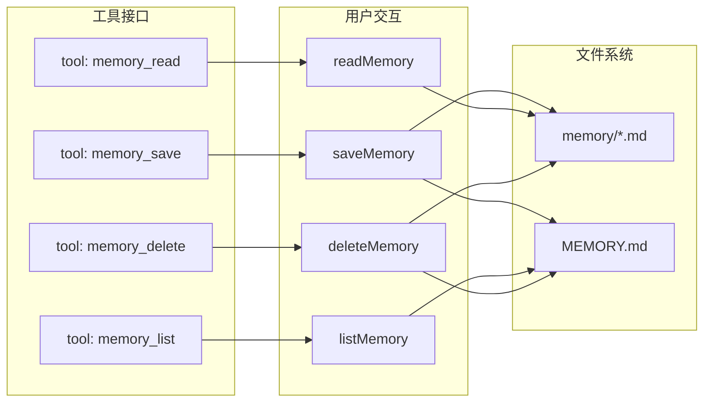

# 06. 记忆系统：让 Agent 记住你

> 从零到一实现一个 AI Agent 框架 · 第六篇

---

## 1. 先看一个问题

```
轮到你：
你说："我有个 Python 脚本跑不通，帮我看看"

Agent（第一轮）："好的，nanki。让我看看你的脚本。"
（中间修好了，你又说了一些事情，对话越来越长）

你说："compact"
Agent 把之前的对话压缩成摘要。

你再问："继续刚才的工作"
Agent（压缩后）："你好，有什么可以帮你的？"
```

它把你忘了。**每次压缩都是一次失忆。**

这就是 Agent 框架最头疼的问题之一：**LLM 的上下文窗口不是持久存储。** 压缩一触发，用户名字、项目决策、你的偏好……全没了。

---

## 2. 从零开始：记忆系统要存什么？

先想想，什么样的信息值得"记住"？

### 2.1 四种记忆

```
类型       │ 例子                      │ 存多久
───────────┼──────────────────────────┼────────
用户记忆   │ 名字叫 nanki，喜欢简洁   │ 永久
反馈记忆   │ "上次你写太长，短一点"   │ 永久
项目记忆   │ "用 Python 3.12 不是 3.11"│ 项目结束前
参考记忆   │ API 文档在 xxx            │ 长期
```

你告诉 Agent 的事，大部分是**一次性指令**（比如"帮我查下 META 股价"），不需要记住。但有些是**持久事实**（比如"我叫 nanki"），值得长期保存。

**区分临时指令和持久信息**——这是记忆系统的核心判断。

### 2.2 最简单的存储

不需要数据库。一个文件夹就够了：

```
.axon/projects/{projectId}/memory/
├── MEMORY.md
├── user_user_nanki.md
├── feedback_write_shorter.md
└── project_use_py312.md
```

每个文件存一条记忆。`MEMORY.md` 是目录索引。

```markdown
# Memory Index

- **[user_nanki](user_user_nanki.md)** (user) — 用户名字是 nanki
- **[feedback_write_shorter](feedback_write_shorter.md)** (feedback) — 回答要简洁
- **[project_use_py312](project_use_py312.md)** (project) — 用 Python 3.12
```

Agent 对话开始时，先读 `MEMORY.md`，就知道自己"应该知道什么"。

---

## 3. 最少工具集

记忆系统最少需要几个工具？四个。

### 3.1 memory_save — 记住

```typescript
async function saveMemory(type, title, content) {
  // slug: "user" + "用户 nanki" → "user_user_nanki.md"
  const filename = `${type}_${slugify(title)}.md`;
  const filePath = path.join(MEMORY_DIR, filename);

  // 写入记忆内容
  fs.writeFileSync(filePath, formatMemoryContent(type, title, content));

  // 更新索引
  rebuildIndex();

  return `已记住：${title}`;
}
```

### 3.2 memory_read — 回忆

```typescript
async function readMemory(type?) {
  if (type) {
    // 读取某一类记忆
    return readFiles(MEMORY_DIR, `${type}_*.md`);
  }
  // 读取全部
  return readFile(MEMORY_DIR, 'MEMORY.md');
}
```

### 3.3 memory_list — 看目录

```typescript
async function listMemory() {
  return readFile(MEMORY_DIR, 'MEMORY.md');
}
```

### 3.4 memory_delete — 忘记

```typescript
async function deleteMemory(type, title) {
  const filename = `${type}_${slugify(title)}.md`;
  fs.unlinkSync(path.join(MEMORY_DIR, filename));
  rebuildIndex();
  return `已忘记：${title}`;
}
```

---

## 4. 工程演进：记忆系统要解决哪些问题？

### 4.1 谁来决定存什么？

一个简单原则：

```
Agent 应该存：
  ✓ 用户明确说 "记住 XXX"
  ✓ 用户给了通用反馈（"别用文言文"）
  ✓ 项目级别的决定（"用 PostgreSQL 不是 MySQL"）
  ✓ 外部资源链接（"文档在 internal/wiki"）

Agent 不应该存：
  ✗ 代码细节（直接看代码就行）
  ✗ Git 历史（有 git log）
  ✗ 文档已有的内容（直接引用文档）
  ✗ 一次性的临时指令
```

问题是——LLM 不一定有这个判断力。你可能需要对 Agent 说：

```
"记住这个：回答要控制在 3 句话以内"
```

Agent 调用 `memory_save("feedback", "回答要短", "控制在3句话以内")`。

下次对话：

```
Agent 启动时：
  → memory_list() → "回答要短"
  → 哦，用户喜欢简短
  → 好

你说："帮我查 META PE"
Agent 回复："24.5x"（不是三页分析报告）
```

### 4.2 怎么避免记忆膨胀？

如果 Agent 什么都存，记忆目录会爆炸。

**解法：同标题覆盖。** 两次保存 "user_nanki"，第二次覆盖第一次：

```typescript
function slugify(title: string): string {
  return title
    .toLowerCase()
    .replace(/\s+/g, '_')
    .replace(/[^a-z0-9_]/g, '');
}

// "用户 nanki" → "user_nanki.md"
// 再次 "用户 nanki" → "user_nanki.md"（覆盖）
```

### 4.3 对话压缩后怎么恢复？

这是记忆系统的核心场景。

**压缩前：**

```
Agent 有完整上下文：
  - 用户叫 nanki
  - 项目用 Python 3.12
  - WIP: 写数据管道
```

**压缩后：**

```
Agent 看到 MEMORY.md：
  - 用户叫 nanki（从 memory 恢复）
  - 项目用 Python 3.12（从 memory 恢复）
  - WIP: 写数据管道（来自压缩摘要，不是 memory）

差异：
  从 memory 恢复的 → 精确、可操作
  从压缩摘要恢复的 → 模糊、可能遗漏
```

### 4.4 跨项目记忆

如果用户同时在两个项目工作：

```
项目 A (web-app)：
  ├── memory/user_user_nanki.md
  └── memory/project_use_react.md

项目 B (data-pipeline)：
  ├── memory/user_user_nanki.md    ← 同名，可以复制
  └── memory/project_use_python.md
```

用户记忆跨项目共享？目前 Axon 是**项目隔离**的——每个项目的 memory 目录独立。要共享的话……你可以在 04 动手实验里实现一个"全局记忆"。

---

## 5. 代码解剖：Axon 的记忆系统

核心在 `src/tool/memory/` 目录下。

### 流程图



### 索引重建

```typescript
// src/tool/memory/index.ts

function rebuildIndex(): void {
  const files = fs.readdirSync(MEMORY_DIR)
    .filter(f => f.endsWith('.md'));

  const entries = files
    .filter(f => f !== 'MEMORY.md')
    .map(f => {
      const content = fs.readFileSync(
        path.join(MEMORY_DIR, f), 'utf-8'
      );
      // 从文件内容中提取标题和类型
      const type = content.match(/type: (.+)/)?.[1] || 'unknown';
      const desc = content.match(/description: (.+)/)?.[1] || '';

      const slug = f.replace('.md', '');
      return `- **[${slug}](${f})** (${type}) — ${desc}`;
    })
    .join('\n');

  fs.writeFileSync(
    path.join(MEMORY_DIR, 'MEMORY.md'),
    `# Memory Index\n\n${entries || '*暂无记忆*'}\n`
  );
}
```

---

## 6. 动手实验：让 Agent 记住你

### 实验一：让 Agent 记住你的名字

```
用户：记住，我叫 nanki
```

看 Agent 会不会调用 `memory_save("user", "用户 nanki", ...)`。

然后说 `compact`，再问：

```
用户：我叫什么名字？
```

如果没有记忆系统，Agent 会忘。有的话，它应该能正确回答。

### 实验二：反馈记忆

```
用户：下次回答不要超过 200 字
Agent：好的
（继续聊，说 compact）

用户：帮我分析一下 AAPL 的财报
```

看 Agent 的回复长度。

### 实验三：查看记忆内容

```
用户：你都记住了关于我的什么？
```

Agent 应该调用 `memory_list()` 返回所有记忆。

### 动手改代码

打开 `src/tool/memory/`，试试：

1. **加过期时间**：每个记忆带 `expiresAt`，过期自动删除
2. **记忆评分**：每次 memory_read 时 track 使用频率，低频自动清理
3. **全局记忆**：把用户记忆放在项目外共享

---

**上一篇**：[Skill 系统：注入专业能力](/blog/axon-skill-system) → **下一篇**：[多 Agent 协作：从独奏到交响](/blog/axon-multi-agent-collaboration)

一个 Agent 不够用怎么办？多个 Agent 怎么找到对方、怎么发消息、怎么分工？用 MCP 协议。
