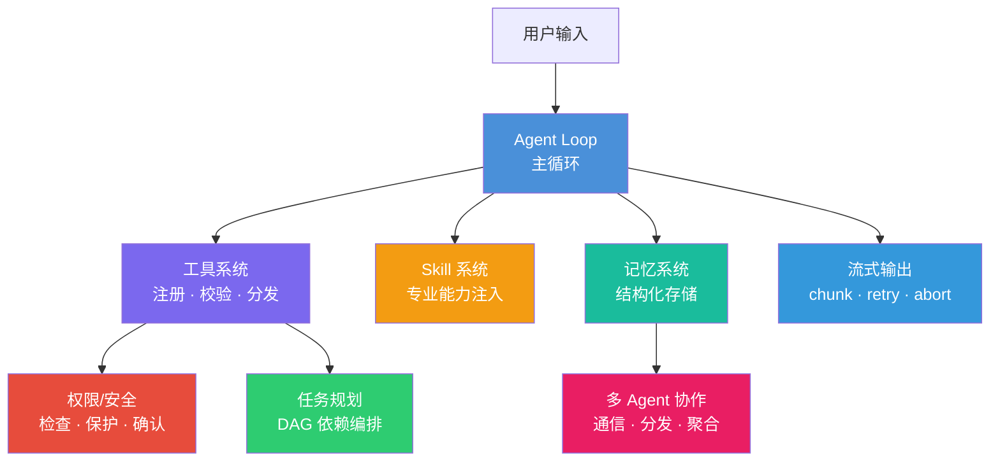

# 00. 系列概览：从零搭一个 AI Agent 框架

> 这是一个教学系列，基于 [Axon](https://github.com/nanki/axon) 项目，带你从零理解 AI Agent 框架的核心设计。

---

## 为什么要写这个系列？

我一直在学习和研究 AI Agent 的工程实现。市面上讲解 Agent 概念的文章很多，但能深入到代码层面、讲清楚每个设计决策的并不多。

这个系列是我的学习笔记，也是写给想深入 Agent 工程的人看的。

---

## 系列文章一览

| # | 模块 | 标题 | 核心内容 |
|---|------|------|---------|
| 01 | Agent Loop | Agent 大脑：主循环是怎么转起来的 | 思考→行动→观察的闭环，循环边界，上下文管理 |
| 02 | 工具系统 | 让 Agent 有手有脚 | 工具注册、Schema 生成、参数校验、MCP 集成 |
| 03 | 权限/安全 | 别让 Agent 乱跑 | 权限检查链、敏感信息保护、用户确认机制 |
| 04 | 任务规划 | 拆解复杂目标 | DAG 任务模型、依赖解析、状态管理 |
| 05 | Skill 系统 | 注入专业能力 | 技能定义、条件匹配、加载执行 |
| 06 | 记忆系统 | 让 Agent 记住你 | 记忆类型、存储检索、持久化 |
| 07 | 多 Agent 协作 | 从独奏到交响 | 通信协议、任务分发、子 Agent 生命周期 |
| 09 | 流式输出 | 让 Agent 边想边说 | Streaming chunk、工具调用拼接、重试、AbortSignal |

## 模块关系图

## 阅读顺序

建议按编号顺序阅读。每篇文章都从最朴素的问题出发，逐步推导 Axon 的设计方案。

第一篇不依赖任何前置知识。后续文章会假设你已经理解了 Agent Loop 的基本概念。

---

## 关于 Axon

Axon 是一个 TypeScript 实现的 AI Agent 框架，代码量适中（核心约 2000 行），适合作为学习 Agent 工程的教学案例。

系列中所有代码分析都基于 Axon 的真实实现，但我会做简化处理，让你能抓住主线逻辑，不被细节淹没。

读完整个系列，你不仅能理解 Axon 的设计，也能自己动手搭建一个 Agent 框架的核心组件。
