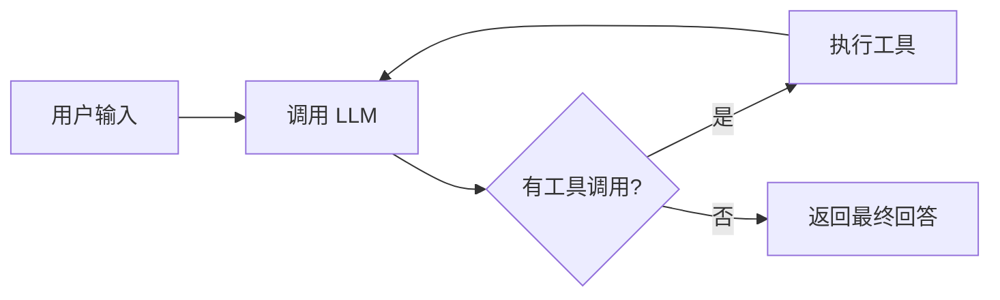
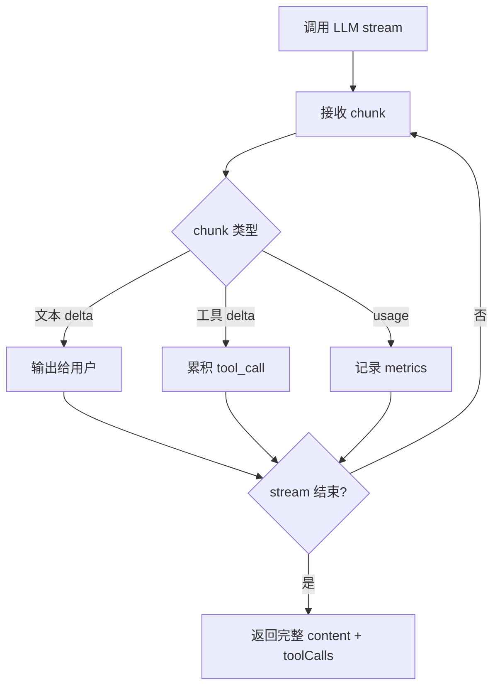

# 09. 流式输出：让 Agent 边想边说

> 从零到一实现一个 AI Agent 框架 · 第九篇

---

## 1. 为什么需要 Streaming？

先看一个普通的 LLM 调用。

```text
用户：帮我分析这个项目的工具系统
      ↓
等待 15 秒
      ↓
LLM：这是完整分析……
```

这 15 秒里，用户看到的是空白。

问题不只是“慢”。更麻烦的是：

- 用户不知道 Agent 是卡住了，还是正在生成。
- 如果方向错了，用户只能等完整回答出来才发现。
- 长回答会让终端像死了一样。
- Ctrl+C 中断时，用户没有足够反馈判断该不该中断。

加上流式输出之后，体验变成这样：

```text
用户：帮我分析这个项目的工具系统
      ↓
LLM：工具系统的核心是……
      ↓
LLM：它主要分为注册、权限、分发……
      ↓
LLM：下面看 Axon 的实现……
```

模型还在生成，用户已经开始阅读。

这就是 **Streaming（流式输出）** 的价值：把“等待完整结果”变成“持续接收增量结果”。

---

## 2. 从零开始：最小 Streaming

非流式调用像这样：

```ts
const response = await client.chat.completions.create({
  model,
  messages,
  stream: false,
})

console.log(response.choices[0].message.content)
```

模型生成完整回答后，服务端一次性返回。

流式调用则不同：

```ts
const stream = await client.chat.completions.create({
  model,
  messages,
  stream: true,
})

for await (const chunk of stream) {
  const text = chunk.choices[0]?.delta?.content
  if (text) process.stdout.write(text)
}
```

这里的关键变化是：

| 非流式 | 流式 |
|--------|------|
| 一次性拿到完整 message | 多次拿到 chunk |
| `message.content` | `delta.content` |
| 最后统一打印 | 边收到边打印 |
| 用户等待完整结果 | 用户持续看到进展 |

最小 streaming 其实不复杂。

真正复杂的是：Agent 不只会输出文字，还会调用工具。

---

## 3. 工具调用为什么让 Streaming 变复杂？

OpenAI-compatible 的流式响应里，工具调用不是一次性到达的。

例如模型想调用：

```json
{
  "name": "read_file",
  "arguments": "{\"path\":\"src/agent.ts\"}"
}
```

流式过程中可能拆成这样：

```text
chunk 1: tool_call index=0, name="read_file", arguments="{\"path\""
chunk 2: tool_call index=0, arguments=":\"src/"
chunk 3: tool_call index=0, arguments="agent.ts\"}"
```

也就是说，Agent 必须一边接收 chunk，一边把工具调用拼起来。

```ts
const toolCallMap: Record<number, ToolCall> = {}

for await (const chunk of stream) {
  const delta = chunk.choices[0]?.delta

  if (delta?.tool_calls) {
    for (const tc of delta.tool_calls) {
      if (!toolCallMap[tc.index]) {
        toolCallMap[tc.index] = {
          id: tc.id ?? "",
          name: tc.function?.name ?? "",
          arguments: "",
        }
      }

      if (tc.function?.arguments) {
        toolCallMap[tc.index].arguments += tc.function.arguments
      }
    }
  }
}
```

为什么用 `index`？

因为一次模型响应里可能有多个工具调用，而且它们的参数 chunk 可能交错到达。`index` 是把碎片拼回正确工具调用的锚点。

---

## 4. Streaming 在 Agent Loop 里的位置

Streaming 不改变 Agent Loop 的本质。

原来的循环是：



加了 streaming 之后，只是把“调用 LLM”这一格拆细：



注意最后仍然要返回完整结果。

因为 Agent Loop 后续还需要：

- 把 assistant message 写入历史。
- 判断 `finishReason` 是不是 `tool_calls`。
- 执行工具。
- 把工具结果塞回 messages。
- 进入下一轮 LLM 调用。

所以 streaming 的职责不是替代 Agent Loop，而是让 LLM 调用过程变成可观察的增量事件。

---

## 5. Axon 的 Streaming 实现

Axon 的核心代码在 `src/agent.ts`。

简化后是这样：

```ts
private async callApiOnce(): Promise<ApiResult> {
  const stream = await this.client.chat.completions.create({
    model: this.model,
    messages: [
      { role: "system", content: this.systemPrompt },
      ...this.messages,
    ],
    tools: DEFINITIONS,
    stream: true,
    stream_options: { include_usage: true },
  }, { signal: this.abortController?.signal })

  let content = ""
  let finishReason = "stop"
  let usage
  const toolCallMap: Record<number, ToolCall> = {}

  for await (const chunk of stream) {
    if (chunk.usage) usage = chunk.usage

    const choice = chunk.choices[0]
    if (!choice) continue

    if (choice.finish_reason) {
      finishReason = choice.finish_reason
    }

    const delta = choice.delta

    if (delta.content) {
      this.events.onTextDelta?.(delta.content)
      content += delta.content
    }

    if (delta.tool_calls) {
      // 按 index 拼接工具调用
    }
  }

  this.events.onTextDelta?.("\n")
  return { content, toolCalls: Object.values(toolCallMap), finishReason, usage }
}
```

这里有几个关键点。

### 5.1 `stream: true`

```ts
stream: true
```

告诉 provider 返回 AsyncIterable，而不是普通 response。

### 5.2 `stream_options.include_usage`

```ts
stream_options: { include_usage: true }
```

让最后的 chunk 带上 token usage。这样 `/metrics` 才能统计：

- 本次输入 token
- 本次输出 token
- 累计输入 token
- 累计输出 token

### 5.3 `AbortSignal`

```ts
{ signal: this.abortController?.signal }
```

让 Ctrl+C 可以中断正在进行的 API stream。

这和 CLI 里的 Ctrl+C 双语义配合：

```text
Agent 正在处理 → abort 当前 stream
Agent 空闲     → 再按一次退出进程
```

---

## 6. 输出事件：不要把 runtime 绑死到 stdout

最早的实现可以直接写：

```ts
process.stdout.write(delta.content)
```

这很直观，但有个问题：`Session` 被绑死到了终端输出。

以后如果想做这些事情，就会很别扭：

- 测试 streaming 输出。
- 把 Axon 接到 Web UI。
- 做更复杂的 TUI。
- 录制完整 transcript。
- 给工具调用状态做统一渲染。

所以 Axon 把输出抽成了 `SessionEvents`：

```ts
export interface SessionEvents {
  onTextDelta?: (text: string) => void
  onToolCallDelta?: (delta: {
    name?: string
    argumentsDelta?: string
  }) => void
  onRetry?: (event: RetryEvent) => void
}
```

默认事件仍然写终端：

```ts
{
  onTextDelta: (text) => process.stdout.write(text),
  onToolCallDelta: (delta) => {
    if (delta.name) process.stdout.write(`\n⚙ ${delta.name}`)
    if (delta.argumentsDelta) process.stdout.write(".")
  },
}
```

但测试或其他 UI 可以传自己的实现：

```ts
const deltas: string[] = []

const session = new Session(
  apiKey,
  model,
  agentsContext,
  memoryContext,
  hooks,
  baseURL,
  client,
  skillLoader,
  {
    onTextDelta: (text) => deltas.push(text),
  },
)
```

这个变化很小，但边界很重要：

> Agent runtime 负责产生事件，CLI 负责渲染事件。

---

## 7. API 重试：不是所有失败都该重试

流式请求跑到一半，也可能失败：

```text
HTTP 429        速率限制
HTTP 503        服务暂时不可用
ECONNRESET      连接被重置
ETIMEDOUT       网络超时
overloaded      模型服务过载
```

这些失败通常是临时的，可以重试。

但下面这些就不应该重试：

```text
HTTP 400        请求参数错
HTTP 401        API key 错
HTTP 404        模型名错
```

重试不会让错误配置突然变对，只会浪费时间和 token。

Axon 的判断逻辑是：

```ts
export function isRetryableApiError(error: any): boolean {
  const status = error?.status ?? error?.statusCode
  if ([429, 503, 529].includes(status)) return true
  if (["ECONNRESET", "ETIMEDOUT"].includes(error?.code)) return true

  const message = String(error?.message ?? "").toLowerCase()
  return message.includes("overloaded")
      || message.includes("temporarily unavailable")
}
```

然后用指数退避：

```ts
const delayMs =
  Math.min(1000 * 2 ** attempt, 30_000)
  + Math.floor(Math.random() * 1000)
```

等待时间大致是：

```text
第 1 次重试：1s + jitter
第 2 次重试：2s + jitter
第 3 次重试：4s + jitter
```

为什么要加随机抖动？

如果很多客户端都在服务过载后固定 1 秒重试，它们会同时冲回去，形成“重试风暴”。随机抖动可以把请求打散。

---

## 8. Anthropic 适配：统一接口背后的差异

Axon 的主循环使用 OpenAI-compatible chunk 格式。

但 Anthropic 的原生 stream 事件长得不一样：

```text
content_block_start
content_block_delta
message_delta
message_stop
```

所以 Axon 有一个 adapter：

```text
Anthropic stream event
        ↓
providers/anthropic.ts
        ↓
OpenAI-compatible chunk
        ↓
agent.ts callApiOnce()
```

例如：

| Anthropic 事件 | OpenAI-compatible chunk |
|----------------|-------------------------|
| `text_delta` | `delta.content` |
| `tool_use` start | `delta.tool_calls[].function.name` |
| `input_json_delta` | `delta.tool_calls[].function.arguments` |
| `message_delta.stop_reason` | `finish_reason` |
| `message_stop.usage` | `usage` |

这样 `Session` 不需要关心 provider 差异。

这次优化里还补了一个细节：Anthropic adapter 需要透传 `AbortSignal`。

```ts
create(params, options) {
  return anthropicToOpenAIStream(
    anthropic,
    model,
    system,
    messages,
    tools,
    options,
  )
}
```

否则 CLI 里按 Ctrl+C 时，OpenAI provider 能中断，Anthropic provider 却可能继续跑。

---

## 9. 为什么不做“提前执行工具”？

有一种更激进的优化：

> 当流式响应里某个工具调用 block 已经完整接收时，立刻执行这个工具，不等整个模型响应结束。

听起来很好，因为可以把工具执行时间藏在模型继续生成的时间里。

但 Axon 暂时没有做。

原因有三个：

1. **OpenAI-compatible 抽象会被打破**
   提前执行工具更依赖 Anthropic 原生 `content_block_stop` 事件。Axon 当前选择把 provider 统一成 OpenAI chunk，主循环更简单。

2. **收益有限**
   Axon 已经支持并发安全工具批量执行。对于 `read_file`、`search_files` 这类快速工具，响应结束后并发跑已经够快。

3. **权限边界更复杂**
   提前执行必须保证只执行无需确认、只读、并发安全的工具。否则用户还没看到完整模型意图，工具已经动手了。

所以第一阶段更稳的路线是：

```text
先把 streaming 事件、retry、abort、metrics 做扎实
再考虑 provider-specific 的提前工具执行
```

这是一个很典型的工程取舍：不是能做就马上做，而是看它是否值得增加复杂度。

---

## 10. 测试 Streaming

Streaming 测试的关键是构造一个假的 AsyncIterable。

```ts
async function* streamChunks(chunks: any[]) {
  for (const chunk of chunks) {
    yield chunk
  }
}
```

然后 mock client：

```ts
const client = {
  chat: {
    completions: {
      create: vi.fn().mockReturnValue(streamChunks([
        { choices: [{ delta: { content: "hello" } }] },
        {
          choices: [{
            delta: {
              tool_calls: [{
                index: 0,
                id: "call-1",
                function: {
                  name: "read_file",
                  arguments: "{\"path\"",
                },
              }],
            },
          }],
        },
        {
          choices: [{
            delta: {
              tool_calls: [{
                index: 0,
                function: { arguments: ":\"README.md\"}" },
              }],
            },
            finish_reason: "stop",
          }],
        },
      ])),
    },
  },
}
```

这样可以验证三件事：

- 文本 delta 会触发 `onTextDelta`。
- 工具参数碎片会触发 `onToolCallDelta`。
- usage chunk 会进入 metrics。

重试也可以单独测：

```ts
let calls = 0

const result = await withApiRetry(async () => {
  calls++
  if (calls === 1) {
    const error: any = new Error("rate limited")
    error.status = 429
    throw error
  }
  return "ok"
})

expect(result).toBe("ok")
expect(calls).toBe(2)
```

测试不需要真的连模型服务。只要协议边界测住，runtime 行为就稳很多。

---

## 11. 小结

Streaming 的表面作用是“逐字输出”，但对 Agent 来说，它更像一层 runtime 事件系统。

它让三件事变得可见：

1. 模型正在生成什么。
2. 模型准备调用什么工具。
3. API 请求是否失败、是否重试、用了多少 token。

Axon 的实现遵循一个简单边界：

> `Session` 负责接收流式事件并维护 Agent Loop，CLI 负责把事件渲染给用户。

这让 streaming 不只是一个终端打印技巧，而是未来接 TUI、Web UI、日志、metrics、transcript 的基础。

第一版不需要追求最炫的提前工具执行。先把流式输出、AbortSignal、usage、retry 和事件解耦做好，Agent 就已经从“等结果的黑盒”变成了“持续可观察的运行时”。
