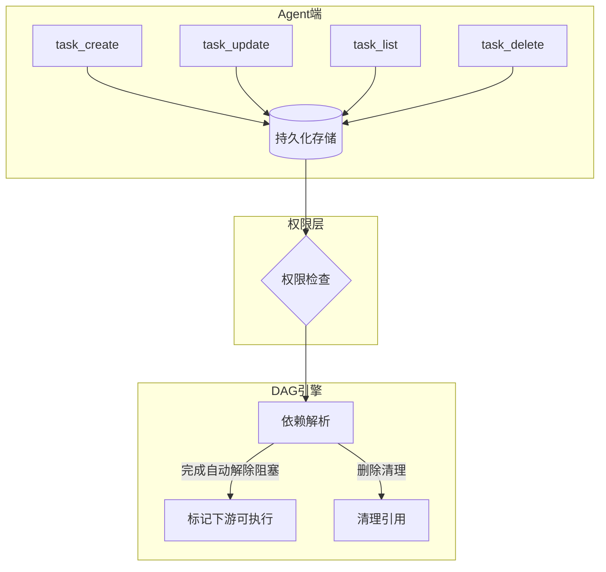

# 04. 任务规划：拆解复杂目标

> 从零到一实现一个 AI Agent 框架 · 第四篇

---

## 1. 为什么需要任务规划？

先看一个场景。

**没有任务规划：**

```
用户：帮我调研三家竞品，每家出报告，最后汇总对比
      ↓
LLM：好的，我一次性全做了...
      → 搜索 A → 搜索 B → 搜索 C
      → 上下文中混合了 A/B/C 的数据
      → 开始写报告，发现 A 的数据忘了记在哪了
      → 重新搜索 A...
      → 上下文越来越长，质量越来越差
```

**有任务规划：**

```
用户：调研三家竞品，出报告，汇总对比
      ↓
Agent Loop：
      创建 4 个任务：
        T1: 调研竞品 A → 状态 pending
        T2: 调研竞品 B → 状态 pending
        T3: 调研竞品 C → 状态 pending
        T4: 汇总对比   → 状态 pending（依赖 T1, T2, T3）

      开始执行 T1（标记 in_progress）
      完成 T1 → 标记 completed → T4 解除一个依赖
      开始执行 T2...
      全部完成 → 开始 T4
```

区别在哪？**Agent 知道自己在做什么、做到哪了、下一步该干嘛。**

这就是任务规划——让 Agent 能拆解、追踪、管理多步骤任务。

---

## 2. 从零开始：最小任务模型

别看 Axon 的实现，我们先自己推——一个任务系统最少需要什么？

### 2.1 任务的数据结构

```typescript
// 最小任务
interface Task {
  id: string;         // 唯一标识
  text: string;       // 任务描述
  status: 'pending' | 'in_progress' | 'completed';
}
```

就这么简单？是的。但很快就发现问题了——

```
用户：先调研竞品 A 和 B，都完成后出汇总报告

Agent：
  T1: 调研 A (pending)
  T2: 调研 B (pending)
  T3: 出汇总报告 (pending)

  如果 Agent 先做了 T3，A 和 B 的数据还没拿到
  报告写了个寂寞。
```

### 2.2 加上依赖关系

```typescript
interface Task {
  id: string;
  text: string;
  status: 'pending' | 'in_progress' | 'completed';
  blockedBy: string[];  // 依赖哪些任务
}
```

现在 T3 可以声明依赖 T1 和 T2：

```
T1: 调研 A (pending)        blockedBy: []
T2: 调研 B (pending)        blockedBy: []
T3: 出汇总报告 (pending)     blockedBy: ['T1', 'T2']
```

Agent 想开始 T3？先检查 `blockedBy` —— T1 和 T2 没完成就不让开始。

这就是 **DAG（有向无环图）** 的核心：节点是任务，边是依赖关系。

> **设计原则：** 依赖关系必须是**无环**的。如果 T1 依赖 T2，T2 依赖 T3，T3 依赖 T1——死锁了。

---

## 3. 工程演进：任务系统要解决哪些问题？

### 3.1 Agent 一次只能做一件事

假设 Agent 同时标记 T1 和 T2 为 `in_progress`：

```
T1: 调研 A (in_progress)    ← Agent 正在搜数据
T2: 调研 B (in_progress)    ← Agent 也在写报告？

Agent 大脑："等等，我到底在干嘛？"
```

LLM 是单线程的。它不能一边搜数据一边写报告。

**解决方案：强制只允许一个任务处于 `in_progress`。**

```typescript
function markInProgress(taskId: string) {
  // 检查有没有其他任务已经在进行
  const currentTask = tasks.find(t => t.status === 'in_progress');
  if (currentTask) {
    throw new Error(`任务 ${currentTask.id} 正在进行中`);
  }
  // 才能标记
  tasks.get(taskId).status = 'in_progress';
}
```

### 3.2 任务完成了，然后呢？

一个任务完成时，依赖它的任务可能就"解封"了。

```typescript
function completeTask(taskId: string) {
  const task = tasks.get(taskId);
  task.status = 'completed';

  // 找所有依赖这个任务的任务
  for (const downstream of findDownstreamTasks(taskId)) {
    // 从 blockedBy 中移除这个任务
    downstream.blockedBy = downstream.blockedBy.filter(id => id !== taskId);

    // 如果 blockedBy 空了，说明所有依赖都完成了
    if (downstream.blockedBy.length === 0) {
      // 任务现在可以执行了
      // 但状态保持 pending，等 Agent 自己来 markInProgress
    }
  }
}
```

注意：Axon 不自动开始下游任务。它只是**解除阻塞**。要不要开始，由 Agent 决定。

### 3.3 对话压缩了，任务还在吗？

如果对话被压缩了，任务信息会丢失吗？

**不会。** 任务状态持久化在磁盘上：

```
.axon/projects/{projectId}/tasks.json
```

每次 `task_create`、`task_update`、`task_delete` 都会写入这个文件。对话压缩后重新加载：

```typescript
// 恢复任务列表
const tasks = JSON.parse(fs.readFileSync(TASKS_FILE, 'utf-8'));
// Agent 看到："哦，我还有 3 个任务没做完"
```

### 3.4 Agent 删了任务怎么办？

如果 Agent 删除了 T1，而 T3 依赖 T1：

```
T3: blockedBy: ['T1', 'T2']
     │
     └── T1 被删了，T3 永远 blocked
```

**解决方案：删除时自动清理引用。**

```typescript
function deleteTask(taskId: string) {
  // 从所有其他任务的 blockedBy 中移除
  for (const task of tasks) {
    task.blockedBy = task.blockedBy.filter(id => id !== taskId);
  }
  // 再删除任务本身
  tasks.remove(taskId);
}
```

---

## 4. 代码解剖：Axon 的任务系统

核心文件是 `src/tool/task.ts`。先看整体设计：



关键代码（简化版）：

```typescript
// src/tool/task.ts（核心逻辑）

// 任务存储
const tasks = new Map<string, Task>();

// task_create
async function handleTaskCreate({ text, blockedBy }: CreateArgs): Promise<string> {
  const id = generateId();

  // 校验依赖任务的 ID 是否有效
  if (blockedBy) {
    for (const depId of blockedBy) {
      if (!tasks.has(depId)) {
        return `错误：依赖任务 ${depId} 不存在`;
      }
    }
  }

  const task: Task = {
    id,
    text,
    status: 'pending',
    blockedBy: blockedBy || [],
  };

  tasks.set(id, task);
  persistToDisk();  // 写入 tasks.json
  return `任务创建成功，ID: ${id}`;
}

// task_update
async function handleTaskUpdate({ id, status }: UpdateArgs): Promise<string> {
  const task = tasks.get(id);
  if (!task) return `错误：任务 ${id} 不存在`;

  if (status === 'in_progress') {
    // 确保没有其他任务在进行中
    const current = Array.from(tasks.values())
      .find(t => t.status === 'in_progress');
    if (current) {
      return `错误：任务 ${current.id} 正在进行中，不能同时进行多个任务`;
    }
  }

  if (status === 'completed') {
    // 自动解除下游依赖
    for (const [tid, t] of tasks) {
      const before = t.blockedBy.length;
      t.blockedBy = t.blockedBy.filter(dep => dep !== id);
      if (before > 0 && t.blockedBy.length === 0) {
        // 依赖全部解除，但状态保持 pending
      }
    }
  }

  task.status = status;
  persistToDisk();
  return `任务 ${id} 已更新为 ${status}`;
}

// task_list
async function handleTaskList(): Promise<string> {
  // 返回所有任务的概要
  const lines = Array.from(tasks.values()).map(t => {
    const deps = t.blockedBy.length > 0
      ? ` [依赖: ${t.blockedBy.join(', ')}]`
      : '';
    return `- ${t.id}: ${t.text} — ${t.status}${deps}`;
  });
  return lines.join('\n') || '暂无任务';
}

// task_delete
async function handleTaskDelete({ id }: DeleteArgs): Promise<string> {
  if (!tasks.has(id)) return `错误：任务 ${id} 不存在`;

  // 从所有依赖中清理
  for (const task of tasks.values()) {
    task.blockedBy = task.blockedBy.filter(dep => dep !== id);
  }

  tasks.delete(id);
  persistToDisk();
  return `任务 ${id} 已删除`;
}
```

几个关键设计点：

**① DAG 依赖通过 `blockedBy` 字段实现**

不是图数据库，不是拓扑排序，就是一个字段——"我依赖谁"。够简单，够用。

**② 删除自动清理引用**

不会出现悬挂的依赖 ID。

**③ 持久化在每次变更时触发**

不是定时保存，不是退出时保存——每次操作都写盘。确保压缩后不丢。

---

## 5. 动手实验：用 Axon 的任务系统

打开你的 Axon 终端：

### 实验一：多步骤调研

```
用户：调研三家竞品，然后汇总对比
```

Agent 应该怎么做？你可以引导它：

```
用户：先用 task_create 创建三个调研任务，然后创建汇总任务，设置依赖
```

看看 Agent 会不会正确设置 `blockedBy`。

如果 Agent 做对了，`task_list` 的输出应该是：

```
- 1: 调研竞品 A — pending
- 2: 调研竞品 B — pending
- 3: 调研竞品 C — pending
- 4: 汇总对比 — pending [依赖: 1, 2, 3]
```

### 实验二：并行 vs 串行

```
用户：任务 1 和 2 没有依赖关系，能不能同时做？
```

试试看。Agent 尝试同时 `task_update("1", "in_progress")` 和 `task_update("2", "in_progress")`。看看会不会被拒绝。

### 实验三：压缩后恢复

```
用户：创建一个任务，然后说 "compact"
      压缩完，再问 "我还有哪些任务？"
```

如果任务系统正常工作，Agent 应该能正确恢复所有任务状态。

### 动手改代码

想深入一点？打开 `src/tool/task.ts`，试试：

1. **去掉单 in_progress 限制** → 看看会出现什么问题
2. **改成自动开始下游任务** → 依赖解除后自动标记 in_progress
3. **给任务加优先级字段** → `priority: 'high' | 'medium' | 'low'`

---

**上一篇**：[Agent 大脑：主循环是怎么转起来的](/blog/axon-agent-loop) → **下一篇**：[Skill 系统：注入专业能力](/blog/axon-skill-system)

当 Agent 需要专业知识（金融分析、医疗报告、法律文书），怎么让它"瞬间学会"？Skill 系统就是干这个的。
