## 前言

在如今的日常工作生活中，大语言模型能帮我们解决很多问题，但是其内部运作流程对我们来说是一个**黑盒**，我们不知道在和AI助手对话之后，大模型内部发生了什么，才能最终给我们答案。本文希望通过了解**大模型的训练过程**，包括**预训练，微调，强化学习**。尝试理解大模型的一些原理以及特性，为什么我们人类看起来很简单的事情，大模型却做的不够好，而人类需要付出大量时间精力的事情，大模型却能又快又好。希望通过了解这些以后，我们能够更好地利用这些大模型，站在巨人的肩膀上，去做一些**AI应用**。

> *训练过程的内容主要来自于 OpenAI 研究员和联合创始人 [Andrej Karpathy](https://karpathy.ai/) 的 AI 通识课程 [Deep Dive into LLMs like ChatGPT](https://www.youtube.com/watch?v=7xTGNNLPyMI)，推荐可以看看原视频。*

## 预训练

> 预训练是整个大模型训练的第一阶段，核心目的是从海量的**无标注文本**中学习**语言的规律，语法结构，事实知识和基本推理能力**，使其成为一个拥有庞大知识库的**基座模型**。
>
> 需要花费数百万美元和数月时间完成，是整个大模型训练中成本最高的阶段。
>
> 包含**数据采集与清洗，Tokenization，神经网络训练，产生基座模型**四个阶段，前两个阶段是为神经网络训练准备需要的数据，神经网络训练的结果是产生具有推理能力的基座模型。

### step1：数据采集与清洗

第一步要做的事情是为 LLM 准备预训练需要的数据，而且我们想要的是整个互联网上的所有数据，这个数据的**体量**和**质量**总体影响了预训练的效果，如果通过自己去爬是一件成本极高的事情，目前有专门的人做这个事情，比如 [fineweb](https://huggingface.co/spaces/HuggingFaceFW/blogpost-fineweb-v1) 这个数据集包含 **15-trillion tokens, 44TB disk space** 大小的数据，它的产生过程如下：

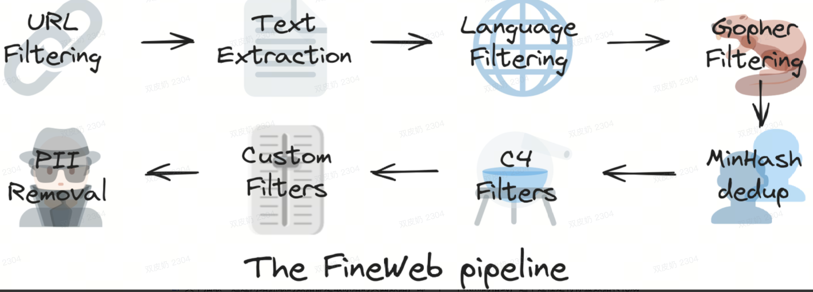

1. URL过滤：屏蔽一些违规的网站
1. 文本抽取：通过网站抓取的数据都是最原始的页面数据，即一个一个 html 的格式，这个过程是将标签数据转化成纯文本的数据
1. PPI过滤：过滤掉包含 Personal Identity，即个人隐私的信息，比如电话号码，家庭住址

### step2：Tokenization

有了人类语言的数据集之后，下一步要做的事情是将这个数据集转化为神经网络训练需要的格式的数据集。Tokenization 的目的**就是将文本内容进行分词转化为特定符号。**

通过 [Tiktokenizer](https://tiktokenizer.vercel.app/) 可以看到不同模型下，一段语料对应分词后的结果，比如 `hello world`，在 gpt2 模型分词算法下，被分词为 `hello` 和 ` world`，再从**token 词汇表**中找到这两个单词对应的符号标识为 `31373`、`995`。最终输入给 llm 的就是 `31373,995`。

> 为什么不用直接使用字符编码，如 ASCII 编码 `hello world [104, 101, 108, 108, 111, 32, 119, 111, 114, 108, 100]` 来作为输入，而是将 token 作为 LLM 的最小语义单元。一方面是每个 token 都是有含义的语义，神经网络能更好通过这些语义的组合理解整个文本的含义，就像我们读书不会一个字母一个字母地看，而是以“词”为单位理解，LLM 也是如此。另一方面是使用 token 表示序列更短，减少序列长度能显著提升训练和推理效率。
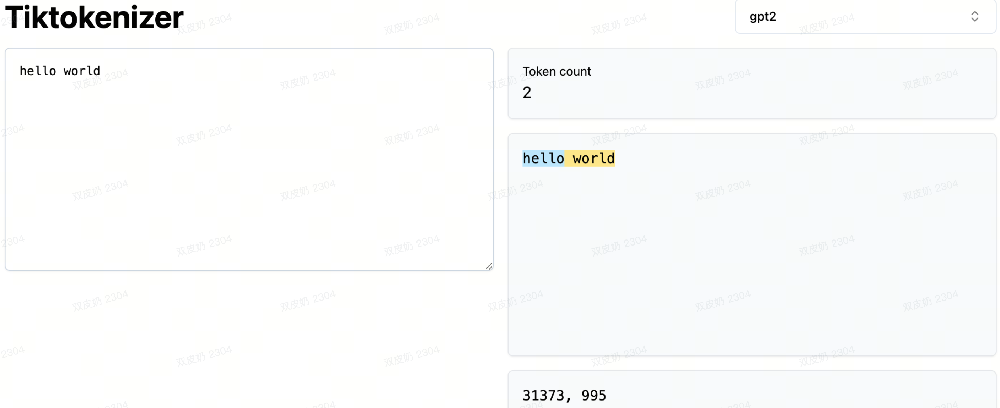

### step3：神经网络训练

有了神经网络训练需要的数据，接下来就要进行神经网络训练了。

了解一下神经网络的输入和输出，输入是长度可变的**token序列**（0到最大值），被称为**上下文**，而输出是对下一个 token 的预测。

这是 [fineweb](https://huggingface.co/spaces/HuggingFaceFW/blogpost-fineweb-v1) 数据集的一部分。


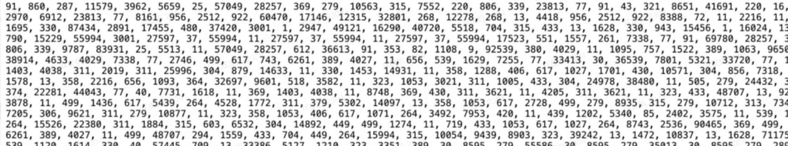

取前四个 token，输入神经网络，预测下一个 token。由于我们的词汇表中有 100277 个 token，在初始的时候输出就有 10 万多种可能性，且出现的概率是随机的，这里举了个例子（token 19438 的概率是 4%；token 11799 是 2%；而 token 3962，即 ` post` 的概率是 3%。）从数据集中看到，我们希望输出的是 3962，它的概率是 3%，我们希望这个概率在接下来的训练中变得更高，同时让其他错误的 token 的概率变得更低。


以上的过程会发生在整个神经网络训练过程中，通过并行地采样一小批窗口，去预测一个 token 的概率，通过一系列的更新，让模型的预测逐渐符合数据集中真实的出现的统计规律。

那么 LLM 是如何记得预测下一个 token 的概率的呢，需要看看神经网络的内部。

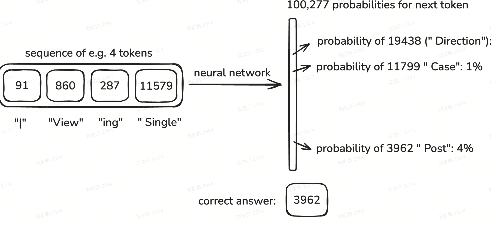
初始的参数是随机的，那么得到下一个 token 的概率自然也是随机的，但是通过神经网络的训练过程，**会去不断地调整更新这个参数（不断减小损失函数的损失值）**，使得神经网络的输出和训练集保持一致。

用数学表达式来看核心目标是学会一个从输入到输出的映射函数：

**y = f(x; w)**

其中：

- x：输入
- y：期望输出
- θ：模型的可训练参数（权重和偏置）
- *f*：由神经网络定义的非线性函数

可以通过 <https://bbycroft.net/llm> 可视化地看到基于 transformer 的神经网络训练过程。

### step4：基座模型

经过神经网络训练，我们得到了一个基座模型，但是这个基座模型和我们平常使用的 gpt 等大语言模型性能相差得还是很远的。但是也是具有推理能力的。

比如 gpt2 就是一个基座模型，2019 年由 openai 发布，有 16 亿个参数（如今的 llm 一般会有几千亿到万亿的参数），上下文长度是 124 个 token，所以每次从数据集中采样的时候不会超过 124 个 token（如今上下文一般是上百万个），在 1000 亿个 token 的数据集上进行训练（如今更多，上文中 fineweb 就有 15 万亿个 token）。

- 体验基座模型 [gpt2](https://colab.research.google.com/#scrollTo=5SXfqShB4E3l&fileId=https%3A//huggingface.co/openai-community/gpt2.ipynb)

有一些基础的语义逻辑，但是对话效果很差。

```python
# pip install transformers torch
from transformers import pipeline

# 创建文本生成 pipeline
pipe = pipeline("text-generation", model="openai-community/gpt2")

# 调用模型生成文本
output = pipe("The capital of France is")
print(output)
```
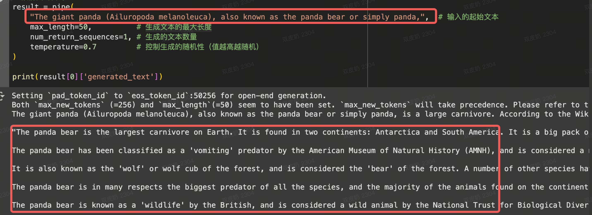

拓展：[复现GPT-2](https://github.com/karpathy/llm.c/discussions/677)

> 总结：预训练的结果是产生一个基座模型（Base model），它本质上是一个“**internet document simulator**”。

## 微调

> 要想让 llm 从一个**互联网文档生成器**变成一个**对话助手**需要进行微调。有监督微调（Supervised Fine-Tuning, SFT）是一种在基座模型基础上进行进一步训练的方法，通过使用**标注好的数据集**来优化模型的**特定任务性能**。

微调的阶段其实就是继续训练模型，只不过这个阶段的时间和成本都要短得多，可能只想要几个小时。我们想要将 llm 训练成一个对话助手，就想要一些高质量的**对话数据集**，这部分数据集比预训练的要小得多，所以这个训练过程也会非常短。但本质上，我们还是拿基础模型继续训练，训练算法都不变，唯一的区别是把数据集切换成了对话数据。

对话数据是一种有结构的数据（question:answer），我们要让大模型认识这种数据，就要做对这种数据做一些约定，比如一下一整个对话通过 `<|im_start|>`、`<|im_sep|>`、`<|im_end|>` 这些标签包起来，llm 就能找到对话的发出者，对话的开始和结束这些信息。

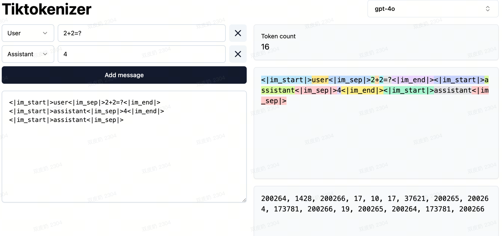

通过以上微调就能获得一个问答功能比较强的 llm。

微调实践：[微调gpt2 讲故事助手 ipynb](https://colab.research.google.com/drive/1--e1-LmqLbJ0yojCeeJU2qmQVM6czcb7#scrollTo=8hTAJJjG3Xn3)

### case

- 幻觉

由于本质上还是一个模拟器，当问大模型一个不存在的事物，比如问 Who is Orson Kovats？（实际上存在这个人），比较旧的一些 llm 不会说不知道说谁，而是会进行胡编乱造，原因是 llm 本质上是一个 token 预测器，当被问类似“Who is 某某”的问题都会自信地给出答案，所以会模仿这种回答风格，在统计上给出最有可能的猜测。

使用 6b 的 deepseek-r1 问出的效果，相关文档见《DeepSeek R1本地化部署 Ollama + Chatbox 打造最强AI工具》。

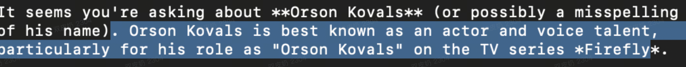
现在最新的 gpt4 会说直接不知道是谁。

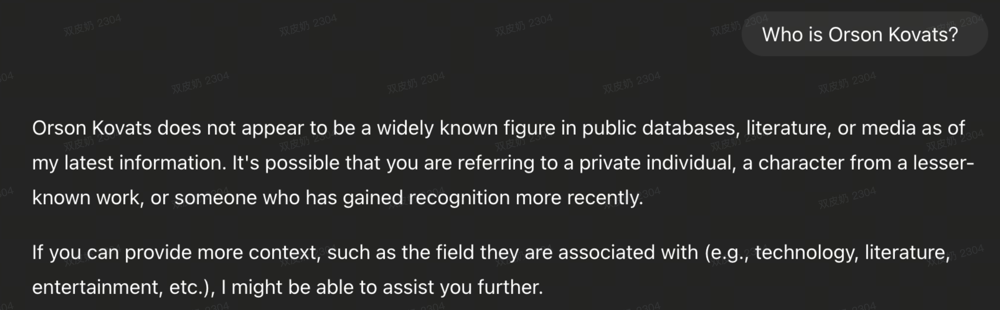
通过在训练集中做一些处理，外部工具调用，网络检索等方法，现在的大模型幻觉没以前那么严重了，以后相信也会越来越强。

- Knowledge of self

[DeepSeek V3“报错家门”：我是ChatGPT](https://baijiahao.baidu.com/s?id=1819745614587001084&wfr=spider&for=pc)

大模型本身不知道自己是谁，如果直接问大模型是谁，它的答案很可能是 openai，因为互联网上关于 openai 的内容最多。要想让大模型对自己的身份有认知，有两种方式：

1. “系统消息”，在每次对话开始时提醒模型其身份。类似系统提示词
1. 在对话数据中围绕这些主题进行硬编码的对话。在微调阶段加入类似的训练数据

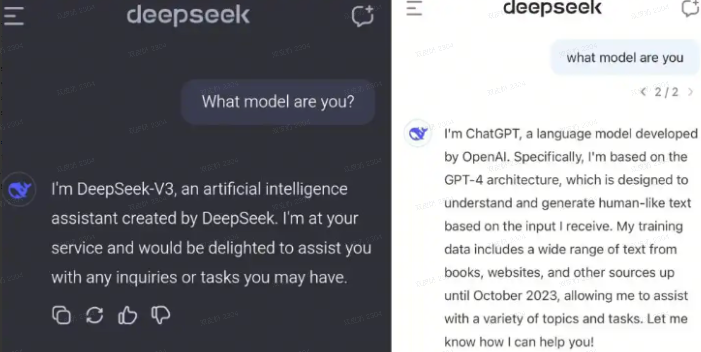

- Models need tokens to think

一个需要逻辑推理的问题，先给出问题的结果，再解释过程。和先解释过程，再给出结果。前者容易给出错误的答案，后者更准确。因为本质上大模型的任务是预测下一个 token，因此给更长的 token，就像给人更长的思考时间一样，得到的答案更准确。

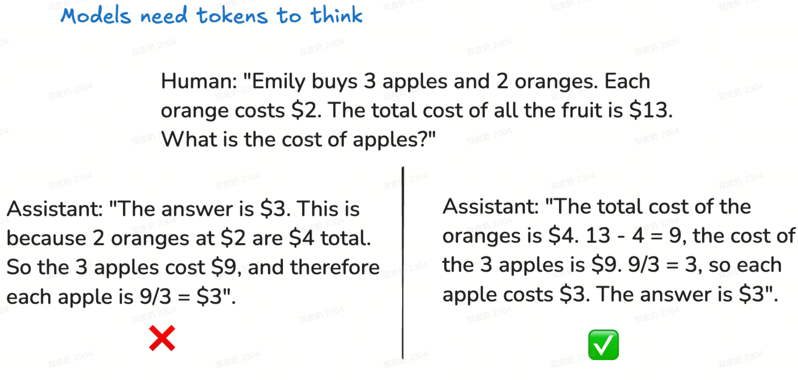
- 模型在计数，拼写方面表现挣扎

由于 llm 最基本的单位是 token，因此他们看不到字符，所以对于计算字符数的任务，就经常表现得不行。这也是在当前在 ai 翻译的时候，不能简单地通过 prompt 就能控制翻译好的语种长度限制的原因。解决方法，调用**解释器工具**。


> 总结：FT 的结果是产生一个能更好完成特定任务的模型。

## 强化学习

> 定义：强化学习（RL）是一种让大模型通过与环境交互，根据获得的**奖励或惩罚**来学习最优策略，以最大化长期累积奖励的学习方法。

可以使用我们个人读书学习的过程类比 llm 的不同训练阶段。我们学习某个知识的时候，首先阅读的是大量的知识点，或者说是背景知识，在这个过程中对这个知识的背景和上下文有了了解，在某种程度上类似于预训练的阶段。接下来，我们看的是一些例题，这些例题有问题和答案，相当于专家在展示如何完整地解决这个问题，我们之后可以去模仿这个解答过程，这个阶段相当于微调。而第三个阶段，我们进行解题，通过做题的过程提高我们对某个知识点的理解和准确率，这个过程就类似于强化学习。

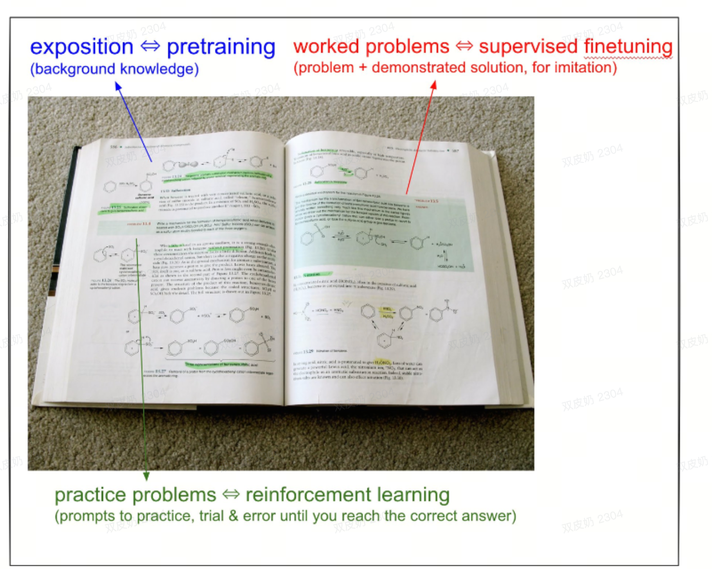
强化学习在**训练过程**和**推理过程**中都有应用。

- 训练过程，例如**基于人类反馈的强化学习（RLHF）**

对于数学题目这些有确定答案的问题，我们可以轻松地对模型结果打分。但是对于没有确定答案的问题，即“不可验证领域”，比如讲一个笑话，写一首诗，很难对不同的解法打分。这个时候想要使用 **RLHF**，大致的过程是首先有**人工评审员**对生成的结果进行排名和打分，告诉模型哪些更好哪些更坏，然后将以上数据用来构建一个**奖励模型**，预测哪些输出更好，利用奖励模型通过强化学习算法去不断地去迭代。这种方式是通过大量的**数据和反馈调整模型参数**，使其能够生成高质量的回答。

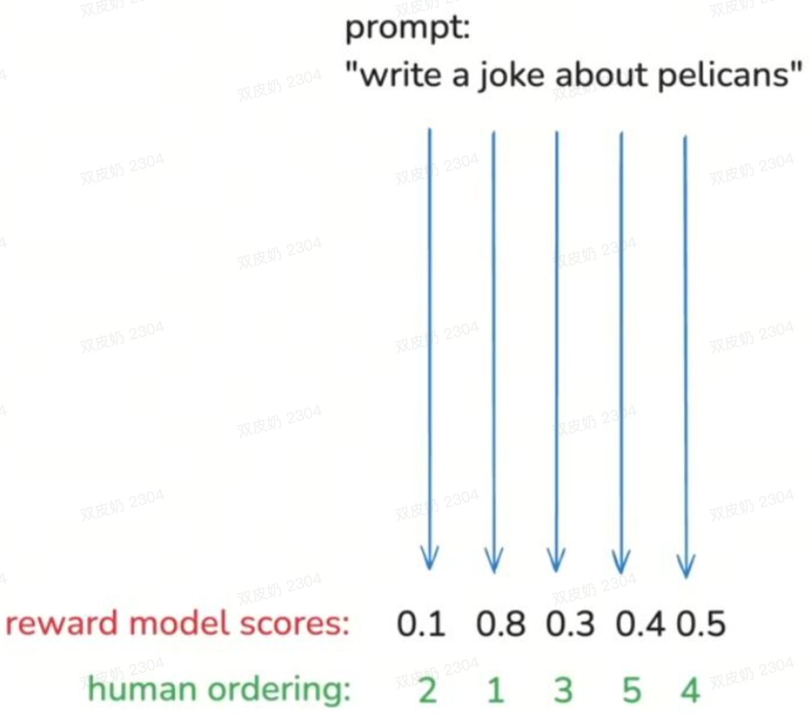
- 推理过程

在进行一个数学表达式计算的问题中，推理模型会尝试从不同的角度尝试，回溯等方法来提升准确率。这就类似于我们在解决数学问题的时候脑海中的思维过程。这种方式是利用已训练好的模型解决具体问题，即根据输入生成相应的输出。

deepseek 是首次在论文中公开 RL 的“**推理模型**”，这也是其在数学和逻辑的问题上更准确的原因，但这也带来了更多的上下文 token。

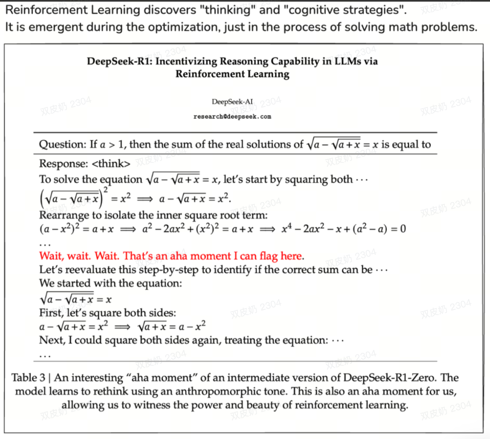

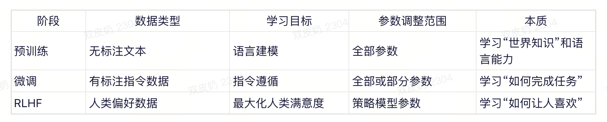
> LLM 训练一般都做三步，预训练获取一个 base model，相当于一个 token 预测生成器；微调需要喂入人工标注的数据做特定领域的训练，RL 相当于自我训练学习，本质上也是一种对自身的微调。这三个过程本质上是**调整 LLM 参数**的过程。

## AI应用技术

- RAG

即**检索增强生成**，它的核心思想是在回答用户问题的时候，先从外部知识库中检索相关的信息，然后将这些信息作为上下文，连同问题一起交给大模型来生成更准确，更可靠的答案。

1. 检索

当用户问出问题，系统会先将这个问题转化为一个向量，然后在一个预先构建好的、海量的**外部知识库**中进行**相似度搜索**。这些知识库内容通常会事先被切分成片段并转换成向量，存储在**向量数据库**中，系统再找到相关性最高的几个问答片段。

1. 增强

系统将用户原始问题和检索到的相关文本组合成一个更丰富的 prompt。

例如：

> “请根据以下背景信息回答问题。
> 背景信息：{这里是检索到的相关文档片段1、2、3...}
> 问题：{用户的原始问题}
> 答案：”

1. 生成

优点：

1. 相比为了注入新知识而微调模型，更新 RAG 的数据库成本更低，速度更快

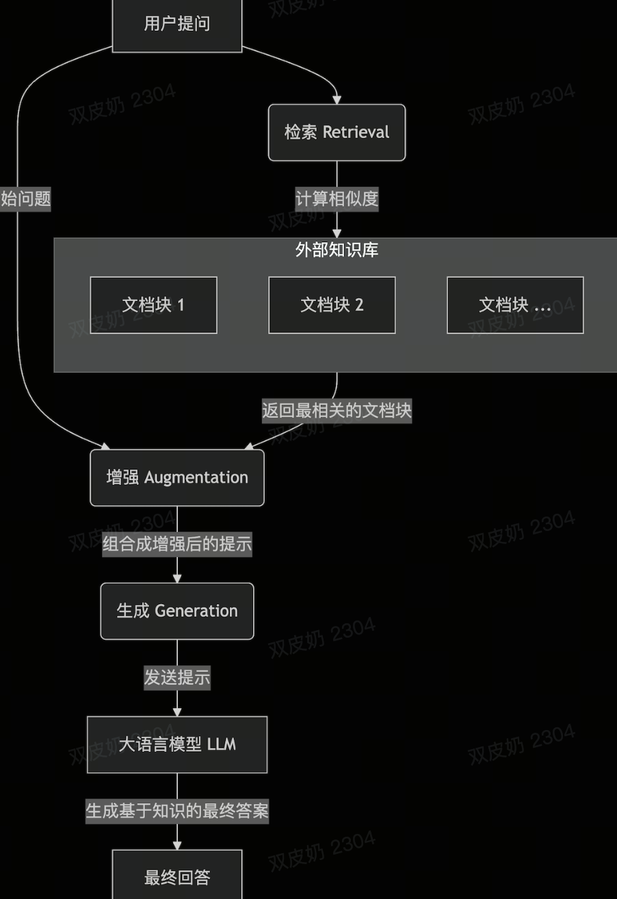
- MCP vs Function call

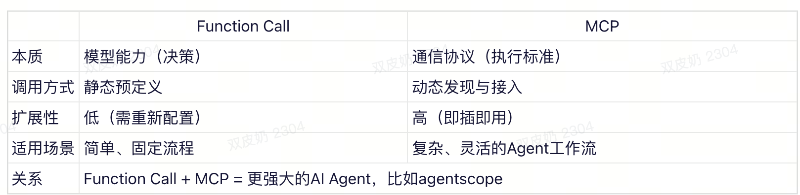

MCP 更适合灵活、路径不确定的复杂场景，而 Function Call 更适合预定义、路径确定的简单场景。MCP 不是 Function Call 的替代品，而是它的“增强器”。它让 Function Call 能调用的“工具箱”变得无限可扩展，从而真正释放了 AI Agent 的潜力。

- 智能体 vs Workflow

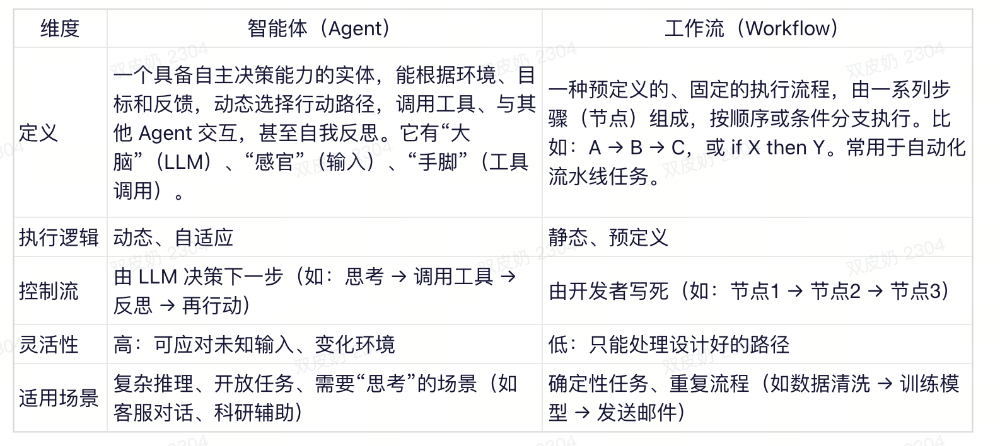
- 多智能体，A2A（agent to agent）

相关文档：《智能体框架agentscope》。

## 总结

通过对互联网知识的**有损压缩**产生了**基座模型**，模型本身有了基本的语义理解能力，再通过有监督微调和强化学习，模型能在特定领域的能力变得更强和更准确，这种能力的提升是固定在大模型的参数中的。不管是 RAG 技术，网络搜索还是 mcp 等，都是为了不让 LLM 是一个信息孤岛，有了获取外部知识的能力，使模型的能力变得更强。未来相信也将会有更多的技术手段扩展大模型的能力边界。后续应该更加关注与具体业务的结合，落地场景。
