# 一条聊天请求如何进入并驱动 Lead Agent

> DeerFlow 源码解读 · 第 01 篇
>
> 分析版本：`f0f9dd66`
>
> 仓库分支：`main`
>
> 验证日期：2026-07-22
>
> 文章状态：待审阅

发送 DeerFlow 聊天消息，并不是“前端直接调模型”。它会先变成 Run，再由 worker 构造 Lead Agent，最后进入 `agent.astream()`。

本文只建立主路径。

## 主路径

```text
sendMessage()
  → thread.submit()
  → LangGraph SDK HTTP POST
  → /api/langgraph/threads/THREAD_ID/runs/stream
  → Nginx 改写为 /api/threads/THREAD_ID/runs/stream
  → stream_run()
  → start_run()
  → asyncio.create_task(run_agent(...))
  → agent_factory(...) == make_lead_agent(...)
  → agent.astream(...)
```



[Mermaid 源文件](assets/01/request-flow.mmd) | [PNG](assets/01/request-flow.png)

| 名字 | 在这条路径中的作用 |
|---|---|
| Thread | 对话和 checkpoint 的容器 |
| Run | Thread 上一次执行，拥有 run id、状态和后台 task |
| Lead Agent | factory 构造出的主 LangGraph Agent 图 |

Thread 可有多个 Run；Run 不是 Agent。

## 从页面到 Gateway

聊天页面的 [`useThreadStream`](https://github.com/Nanki-nn/deer-flow/blob/f0f9dd66/frontend/src/core/threads/hooks.ts#L786-L895) 把 DeerFlow API client 和固定的 `lead_agent` 交给 LangGraph SDK：

```ts
const thread = useStream<AgentThreadState>({
  client: getAPIClient(isMock),
  assistantId: "lead_agent",
  threadId: onStreamThreadId,
});
```

`sendMessage` 处理消息、文件和运行 context 后调用 [`thread.submit()`](https://github.com/Nanki-nn/deer-flow/blob/f0f9dd66/frontend/src/core/threads/hooks.ts#L1354-L1385)。它没有直接 `fetch` Gateway，HTTP 边界属于 SDK。

默认地址来自 [`getLangGraphBaseURL`](https://github.com/Nanki-nn/deer-flow/blob/f0f9dd66/frontend/src/core/config/index.ts#L20-L43)：浏览器使用同源 `/api/langgraph`。Nginx 翻译此前缀：

```nginx
location /api/langgraph/ {
    rewrite ^/api/langgraph/(.*) /api/$1 break;
    proxy_pass http://gateway;
}
```

浏览器使用 `/api/langgraph/threads/THREAD_ID/runs/stream`；直接调 Gateway 则使用 `/api/threads/THREAD_ID/runs/stream`。

## Gateway 先创建 Run，再交给后台 worker

Gateway 的 [`stream_run`](https://github.com/Nanki-nn/deer-flow/blob/f0f9dd66/backend/app/gateway/routers/thread_runs.py#L423-L448) 接收流式请求。它启动 Run 和 SSE consumer，不等待完整答案：

```python
record = await start_run(body, thread_id, request)
return StreamingResponse(
    sse_consumer(bridge, record, request, run_mgr),
    media_type="text/event-stream",
)
```

[`start_run`](https://github.com/Nanki-nn/deer-flow/blob/f0f9dd66/backend/app/gateway/services.py#L622-L660) 把请求整理成 `graph_input` 和 `config`，然后创建后台 task：

```python
agent_factory = resolve_agent_factory(body.assistant_id)
task = asyncio.create_task(
    run_agent(...,
        agent_factory=agent_factory,
        graph_input=graph_input,
        config=config,
    )
)
record.task = task
```

`asyncio.create_task` 是分界线：流已建立，Run 仍可在后台运行。

## factory 怎样变成 Lead Agent

`assistant_id` 看上去像会路由到许多 Agent。当前 Gateway 实现实际返回同一个 Lead Agent factory：

```python
def resolve_agent_factory(assistant_id: str | None):
    from deerflow.agents.lead_agent.agent import make_lead_agent
    return make_lead_agent
```

自定义 Agent 的差异通过 `context` 或 `configurable` 中的 `agent_name` 进入 factory，不在 Gateway 这里换路由。

在 [`run_agent`](https://github.com/Nanki-nn/deer-flow/blob/f0f9dd66/backend/packages/harness/deerflow/runtime/runs/worker.py#L310-L483) 中，worker 先安装 thread、run、用户和 app config 等 runtime context，再把这个 callable 真正执行：

```python
agent = agent_factory(config=initial_runnable_config)

async for chunk in agent.astream(
    input_payload,
    config=stream_config,
    stream_mode=single_mode,
):
    ...
```

运行时进入的就是 [`make_lead_agent`](https://github.com/Nanki-nn/deer-flow/blob/f0f9dd66/backend/packages/harness/deerflow/agents/lead_agent/agent.py#L430-L434)。至此，Lead Agent 图已经构造完毕。模型、工具和 middleware 本篇不展开。

## 跟我设置断点

先用不依赖模型密钥的 E2E 测试。它替换外部模型，但仍经过真实 Gateway route、`start_run`、`run_agent`、`make_lead_agent` 和工具路径：

```bash
cd /Users/bytedance/AI/deer-flow/backend
PYTHONPATH=. uv run pytest \
  tests/test_runtime_lifecycle_e2e.py::test_stream_run_executes_real_lead_agent_setup_agent_business_path \
  -q
```

断点顺序：`stream_run` → `start_run` → `resolve_agent_factory` → `run_agent` → `worker.py:376` → `make_lead_agent` → `worker.py:451`。

本次实际运行了这条测试和一个更小的生命周期测试，结果为 `2 passed`。全线程 trace 的脱敏观察是：

- body 是 `RunCreateRequest`，`assistant_id` 是 `lead_agent`；
- `graph_input` 是只含 `messages` 的 dict；
- Run 进入 worker 时是 `pending`，调用 factory 前已变为 `running`；
- `agent_factory` 的实际值是 `deerflow.agents.lead_agent.agent.make_lead_agent`；
- 本次 `lg_modes` 是 `values`，命中单模式 `agent.astream` 分支。

调试坑：Starlette `TestClient` 把 ASGI 应用放到 `asyncio-portal-*` 后台线程。普通 `python -m pdb -m pytest` 通常只跟踪 pytest 主线程，业务断点可能不命中。让 IDE 跟踪所有线程，或使用能注册到新线程的 trace/debugger。完整证据见 [research/01-evidence.md](research/01-evidence.md)。

## 本轮的证据边界

本机模型配置可加载，但 `make doctor` 显示没有安装 `nginx`。前端 URL 和 Nginx rewrite 是源码事实；Gateway → Lead Agent 是确定性测试事实；本轮没有跑完整浏览器链路。

## 费曼复述

把请求想成工作单：SDK 负责投递，Nginx 像门卫改写地址，Gateway 登记任务卡，后台 worker 再领到 Lead Agent，把工作单和上下文交给它。

三阶段对应 `start_run`、`make_lead_agent` 和 `agent.astream`。

## 小结

一条 DeerFlow 聊天请求先变成 Thread 上的一次 Run，再由 worker 构造 Lead Agent，最后进入 `agent.astream()`。下一篇回到起点，专门拆开 `thread.submit()` 的输入、模式和 context。
